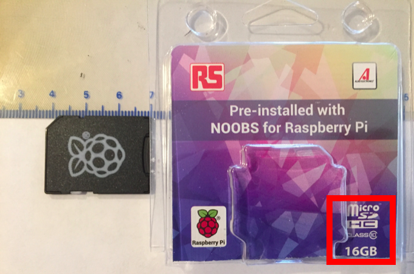
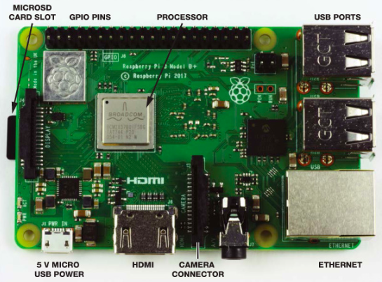
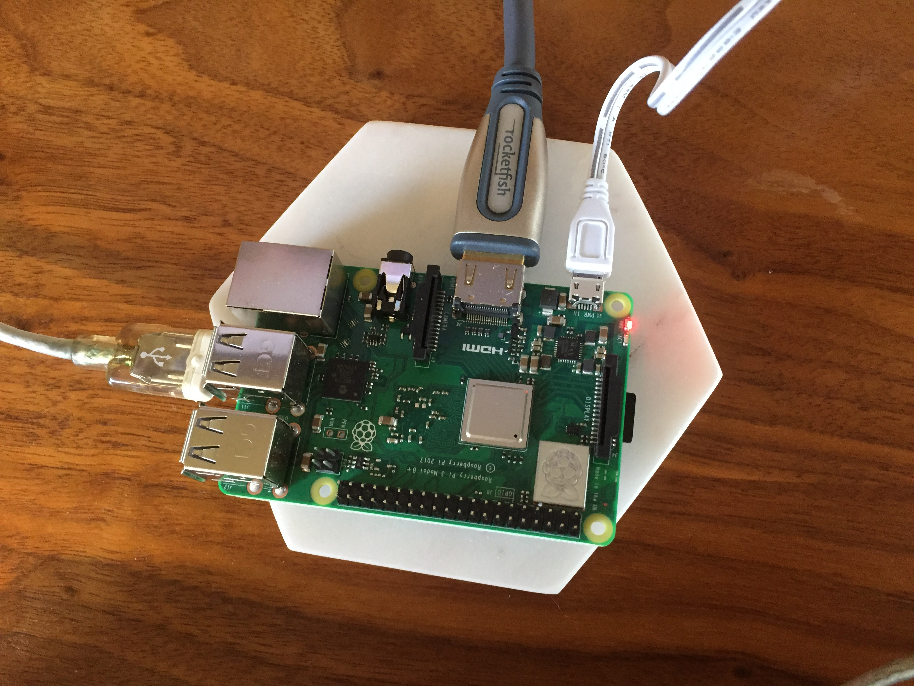
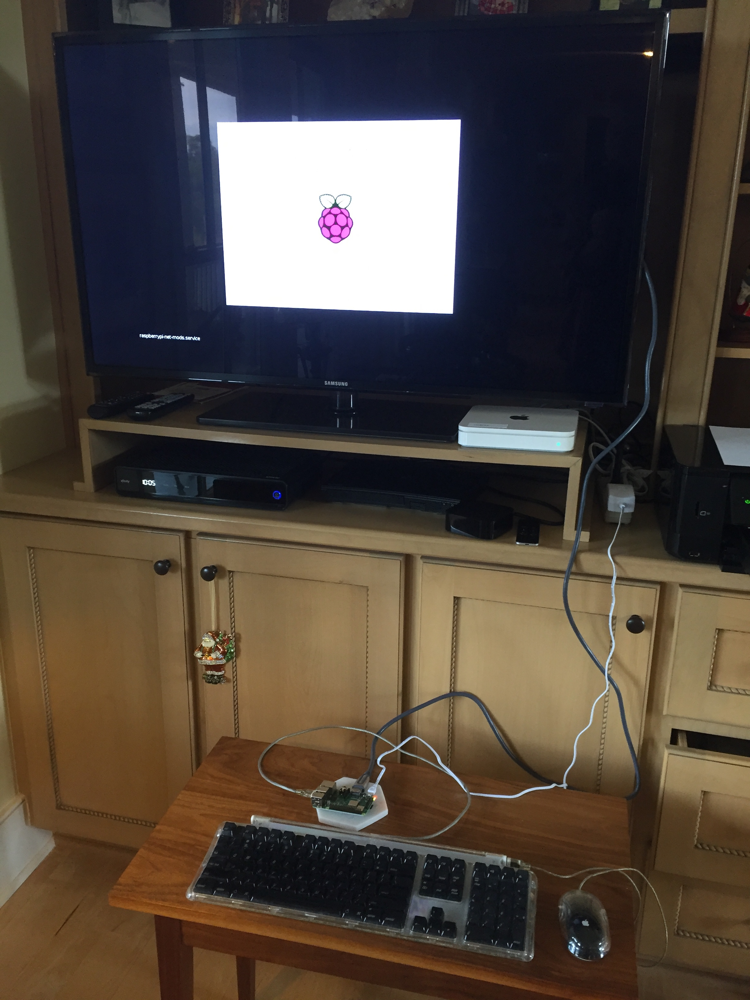

<b>2019 Feb 15</b>

[This](https://www.amazon.com/gp/product/B01H5ZNOYG/ref=ppx_yo_dt_b_asin_title_o07_s00?ie=UTF8&psc=1) looks like a standard SD card, but it is an adapter with a micro SD card inside.  I took me a bit to figure that out  :)

Pull the ridged tab on the side opposite the pins and the cut corner to remove the card from the adapter.

The layout of the Pi 3B+:

The micro SD slot (1) is on the side opposite to the one with the USB and Ethernet ports.  There are two slots stacked, the one we want is on the bottom.  

Turn the board over and insert the card in the standard orientation (pins down).  Or turn the card over (pins up) and insert it with the board in standard orientation.

Micro USB power (2) is on the side opposite the GPIO pins, on the left.  Insert the power cord but don't hook it up to the wall yet.

HDMI (3) is just next to the power.  Hook that up to the TV.

Connect a mouse + keyboard to a USB input.

Plug the sucker in.

