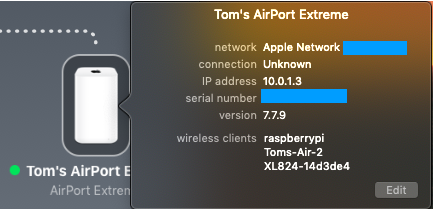
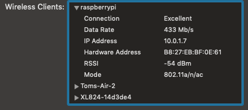
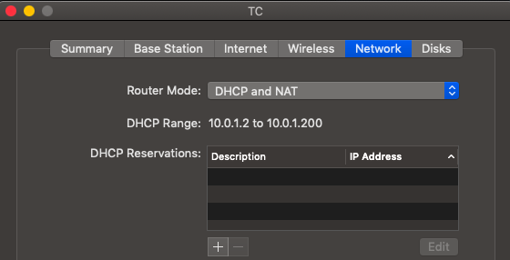

#### Network stuff

At the beginning, after activating WiFi and ssh, we were able to [discover](1.md) the IP address of the Pi by doing ``sudo ifconfig`` from the command line on the Pi.  

Here is the segment of the output relating to WiFi:

```
pi@raspberrypi:~ $ sudo ifconfig
..
wlan0: flags=4163<UP,BROADCAST,RUNNING,MULTICAST>  mtu 1500
        inet 10.0.1.7  netmask 255.255.255.0  broadcast 10.0.1.255
        inet6 fe80::9544:2135:11e1:95cb  prefixlen 64  scopeid 0x20<link>
        ether b8:27:eb:bf:0e:61  txqueuelen 1000  (Ethernet)
        RX packets 368  bytes 92149 (89.9 KiB)
        RX errors 0  dropped 0  overruns 0  frame 0
        TX packets 90  bytes 14714 (14.3 KiB)
        TX errors 0  dropped 0 overruns 0  carrier 0  collisions 0

pi@raspberrypi:~ $
```

We also had ``en0`` and ``lo``.  

The network shown above, ``wlan0``, is the Pi's connection to the wireless LAN (local area network), and its ip address is seen to be ``10.0.1.7``.

We need that address in order to do ``ssh pi@10.0.1.7`` from the Mac.  

<hr>

Questions:  

- where does the ip address come from?
- is it always the same?  
- How to discover it from the network (in headless mode)?
- what about using a hostname?

The ip address is assigned by a DHCP server in the router I'm using, an Airport Extreme.

From the Mac, we can see a number of ip addresses on the network including

```
> arp -a
..
? (10.0.1.7) at b8:27:eb:bf:0e:61 on en0 ifscope [ethernet]
..
>
```

According to the internet, MAC addresses assigned to the Raspberry Pi Foundation start with ``b8:27:eb`` .  Ours apparently is

```
b8:27:eb:bf:0e:61
```

Note:  this comes up on ``arp`` shortly after boot, and even works for a bit after the Pi goes offline!

We can ``ping``

```
> ping 10.0.1.7
PING 10.0.1.7 (10.0.1.7): 56 data bytes
64 bytes from 10.0.1.7: icmp_seq=0 ttl=64 time=3.607 ms
..
```

The time it took for the ping to get to the Pi was 3.6 ms.

#### Airport Utility

Airport Utility will show the Pi's info.  Click on the icon for the Airport Extreme



<i>not</i> the Time Capsule, which is just above that.  It shows some wireless clients.  To get more detail option-click on the icon.

 

Make sure the Summary tab is selected and click the disclosure triangle for the Pi.  We get info about the Pi including

- hostname (raspberrypi)
- IP address (10.0.1.7)
- hardware address (B8:27:EB..)

If a changing ip address were to become an issue, you could option-click on the Time Capsule icon and under the network tab:



register a reservation with the DHCP server in the Airport Extreme.

<hr>

How about ``nmap``
On Pi:  ``sdo apt-get install nmap``.  
On the Mac:  ``brew install nmap``

[link](https://raspberrypi.stackexchange.com/questions/13936/find-raspberry-pi-address-on-local-network)

```
> nmap -sV 10.0.1.7
Starting Nmap 7.70 ( https://nmap.org ) at 2019-02-17 10:58 EST
Nmap scan report for 10.0.1.7
Host is up (0.0083s latency).
Not shown: 999 closed ports
PORT   STATE SERVICE VERSION
22/tcp open  ssh     (protocol 2.0)
1 service unrecognized despite returning data. If you know the service/version, please submit the following fingerprint at https://nmap.org/cgi-bin/submit.cgi?new-service :
SF-Port22-TCP:V=7.70%I=7%D=2/17%Time=5C6984B5%P=x86_64-apple-darwin18.0.0%
SF:r(NULL,29,"SSH-2\.0-OpenSSH_7\.4p1\x20Raspbian-10\+deb9u3\n");

Service detection performed. Please report any incorrect results at https://nmap.org/submit/ .
Nmap done: 1 IP address (1 host up) scanned in 8.35 seconds
>
```

Note:  don't do this to some random website.  It would be considered a hostile act.
