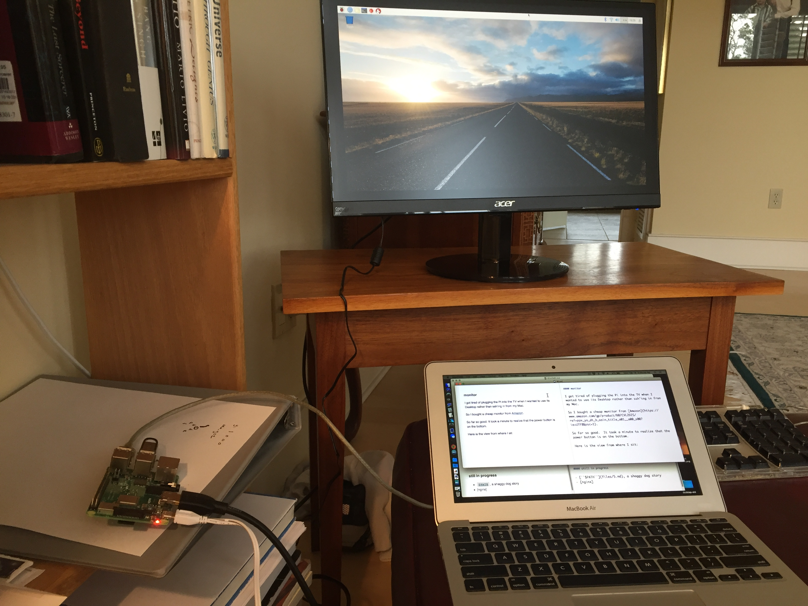

#### monitor

At first I used my TV.

I got tired of plugging the Pi into the TV, someone always wanted to watch a movie.  Most of the time, we will use ssh from another computer, but sometimes you really want the monitor.

So I bought a cheap one from [Amazon](https://www.amazon.com/gp/product/B07CVL2D2S/ref=ppx_yo_dt_b_asin_title_o01__o00_s00?ie=UTF8&psc=1), about $90.

So far so good.  It took a minute to realize that the power button is on the bottom.

Here is the view from where I sit:



When looking at Terminal on the monitor, the font is pretty small.  From [here](https://www.raspberrypi-spy.co.uk/2014/04/how-to-change-the-command-line-font-size/) I get instructions to start a config window on the command line with 

```
sudo dpkg-reconfigure console-setup
```

or you can just edit ``/etc/default/console-setup``.

Suggested edit:

```
FONTFACE="Terminus"
FONTSIZE="16x32"
```

But it doesn't work.  I had to move the whole setup so I can get my face close enough to the screen.