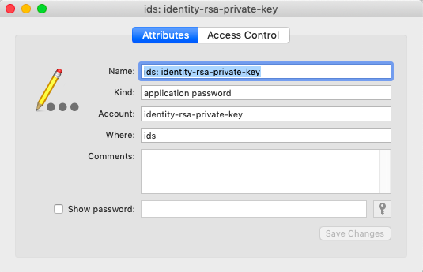

#### passphrase in macOS Keychain

On my Mac, in ``~/.ssh`` I have some old Ubuntu stuff plus my RSA key pair and ``known_hosts``:

- ``id_rsa``
- ``id_rsa.pub``
- ``known_hosts``

To clean things up a bit I copied the old files into a new sub-directory old

```
> ls old
config			ubuntu_id_rsa.pub
ubuntu_id_rsa
```

This turned out to cause problems that were fixed by copying these files back to the parent directory.

When using ssh, it is asking for a passphrase (on the Mac) for ``~/.ssh/id_rsa``. 

```
> ssh pi@10.0.1.7
Enter passphrase for key '/Users/telliott_admin/.ssh/id_rsa': 
pi@10.0.1.7: Permission denied (publickey).
>
```

Why would ssh do that when there is no passphrase for it (as far as I recall)?

It turns out that this file is responsible for the strange behavior:

**~/.ssh/config**

```
Host 127.0.0.1
  IdentityFile ~/.ssh/ubuntu_id_rsa

Host *
    UseKeychain yes
```

When it's missing, ssh starts asking for a passphrase to access ``id_rsa``.

The part of the file that is required:

```
Host *
    UseKeychain yes
```

The answer is [here](https://apple.stackexchange.com/questions/254468/macos-sierra-doesn-t-seem-to-remember-ssh-keys-between-reboots).

I vaguely remember something breaking on a macOS upgrade and this was given as the solution.  I had forgotten.

So according to the ssh "agent", I do have a passphrase for ``id_rsa``.  To [check](https://stackoverflow.com/questions/4411457/how-do-i-verify-check-test-validate-my-ssh-password)

```
> ssh-add
Enter passphrase for /Users/telliott_admin/.ssh/id_rsa: 
> man ssh-add
> ssh-add -L
The agent has no identities.
> ssh-add -d
```

The ``-L`` option says to show identities the agent knows.  This confirms that just return with no passphrase failed to load ``id_rsa``.  The ``ssh-add -d`` deletion is therefore superfluous.

#### Keychain stuff

In my login keychain, there <i>is</i> an item related to the rsa-private-key:



Clicking Show password (and entering my login password) gives nothing.  But the Access Control tab shows:


So I think what's happening is that  ``id_rsa`` probably does have a passphrase, and I've forgotten it.  And, macOS has been set up to require it.  

Since Terminal isn't on the list of applications with access to this item in the keychain, without the config file we are prompted for the passphrase.

Try adding Terminal to the list (and temporarily removing ``config`` from ``~/.ssh``:

And ... that doesn't fix it.  Hmm...

Well, the simplest way to test this is to generate a new key pair with no passphrase and try it out.  That's for the next time.