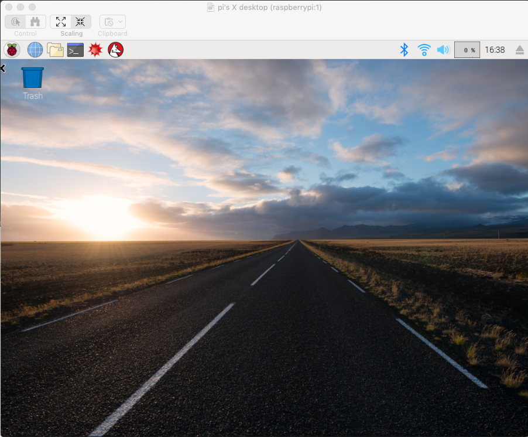

#### Remote Desktop

Google gave me this [link](https://smittytone.wordpress.com/2016/03/02/mac_remote_desktop_pi/).

> using VNC (Virtual Network Computing). VNC is a standard, widely supported way of securely presenting a GUI remotely over a network connection. You need a suitable server running on the machine that will be sharing its desktop, and a client app to present that desktop on the computer you’re accessing the remote machine from. The client relays your mouse and keyboard input back to the remote computer.

> The Raspberry Pi Foundation recommends a specific VNC server, tightvncserver, written by TightVNC Software. You can install in the usual way:

Alrighty then...

```
$ sudo apt-get install tightvncserver
...
```

wait a few minutes for the prompt to come back

```
$ tightvncserver
```

I tried a clever short password (``berry``), which was rejected as too short, so then I entered ``berryplease`` and got

```
Warning: password truncated to the length of 8.
```

!! (I'm amused by primeval password routines)

Prompts for a password for view-only access, I just said no.

```
New 'X' desktop is raspberrypi:1

Creating default startup script /home/pi/.vnc/xstartup
Starting applications specified in /home/pi/.vnc/xstartup
Log file is /home/pi/.vnc/raspberrypi:1.log

$
```

That ``raspberrypi:1`` is important.  According to the link

> 5900 is the base VNC port

Hence 5901.  So ...


#### on the Mac

Do ``CMD + K`` to bring up Go > Connect to Server...

```
vnc://raspberrypi.local:5901
```

And it works!


Actually, I forgot the ``ple`` part of the password ...  Now it really works.



Apple [docs](https://www.apple.com/remotedesktop/)

At this point, I shut down the Pi and go pull the power plug.

```
pi@raspberrypi:~ $ sudo shutdown
Shutdown scheduled for Fri 2019-02-15 16:51:12 UTC, use 'shutdown -c' to cancel.
pi@raspberrypi:~ $ Connection to 10.0.1.7 closed by remote host.
Connection to 10.0.1.7 closed.
>
```

Now that we have the remote Desktop app working, I can unplug the HDMI cable to the TV and the USB to the keyboard.


