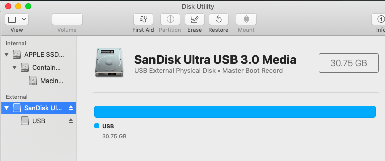

#### Reformatting a USB drive

In Disk Utility:

select the disk and choose erase.  



We need to choose the correct scheme.  Google says:

> Master Boot Record (MBR) disks use the standard BIOS partition table. GUID Partition Table (GPT) disks use Unified Extensible Firmware Interface (UEFI).
> 

so

- name:  TE
- format MS-DOS (FAT)
- scheme Master Boot Record


That will give us FAT32.

If you want to do it from the command line:

```
> diskutil eraseDisk MS-DOS SD MBR /dev/disk2
```

```
Started erase on disk2
Unmounting disk
Creating the partition map
Waiting for partitions to activate
Formatting disk2s1 as MS-DOS (FAT) with name SD
512 bytes per physical sector
/dev/rdisk2s1: 60032320 sectors in 1876010 FAT32 clusters (16384 bytes/cluster)
bps=512 spc=32 res=32 nft=2 mid=0xf8 spt=32 hds=255 hid=2048 drv=0x80 bsec=60061696 bspf=14657 rdcl=2 infs=1 bkbs=6
Mounting disk
Finished erase on disk2
> 
```

This'll also work

```
> sudo newfs_msdos -F 32 /dev/disk2
```

``-F`` is ``FAT-type``, so 32 is the right choice.

Sometimes you will get "Resource busy".  It happens if you just wrote to the disk.  Sometimes the error message will include a ``pid`` (process id).

In order

- quit Terminal and relaunch
- try ejecting the USB drive in Disk Utility (and if it's present eject the special Apple Disk below it that has copy in the name).

As a last resort, it's easily fixed by re-starting.  The OS will find out who is holding your disk and kick them off.
