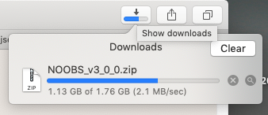

#### Raspbian on USB drive

A primary goal is to discover how to install the Pi OS "headless", without a display or keyboard+mouse, and with WiFi and SSH enabled so we can get into it from the network.

Another goal is to explore the other OS's for the Pi.

However, to begin with, we simply test the new capability to load an OS from a USB mass storage device.

I chose a 32 GB [USB 3.0](https://www.amazon.com/gp/product/B015CH1JIW/ref=ppx_yo_dt_b_asin_title_o00__o00_s00?ie=UTF8&psc=1) from SanDisk.

It comes pre-formatted, but we will erase it.  See [here](22.md).

#### NOOBS

There are a variety of operating systems (OS) available for the Pi.  [Here](https://www.raspberrypi.org/downloads/) is a list.

From [here](https://www.raspberrypi.org/downloads/noobs/) I got NOOBS as a ZIP file.  The download wasn't bad for almost 2 GB, it took about 11 min.



#### NOOBS

The downloaded file is ``NOOBS_v3_0_0.zip``.  Its SHA-256 hash is 

```
> openssl dgst -sha256 NOOBS_v3_0_0.zip 
SHA256(NOOBS_v3_0_0.zip)= 9d0637e2..
```

which matches what's listed on the download page:  ``9d0637e2..``.  

Anyone who could hack the download link could probably change the hash that's listed as well.  But in some real world attacks the listed hash has remained authentic.  There are other defenses but let's just accept that this is OK.

I generally just paste the two strings on adjacent lines in a text file and scan them by eye.  You could easily write a Python script to automate this

The hash method (SHA-256) takes a minute or two --- every bit must be read.

Unzip the file.  You can use ``-t`` first to "test" it.

```
> cd NOOBS
> unzip -t NOOBS_v3_0_0.zip 
Archive:  NOOBS_v3_0_0.zip
    testing: recovery.elf             OK
..
OK
No errors detected in compressed data of NOOBS_v3_0_0.zip.
> 
> unzip NOOBS_v3_0_0.zip
..
>
```

One of the files is ``INSTRUCTIONS-README.txt``.

I put the zipfile in a folder cleverly titled ``NOOBS`` and then ``cd NOOBS`` and ``unzip NOOBS_v3_0_0.zip``.

```
> ls
BUILD-DATA
INSTRUCTIONS-README.txt
NOOBS_v3_0_0.zip
RECOVERY_FILES_DO_NOT_EDIT
bcm2708-rpi-0-w.dtb
bcm2708-rpi-b-plus.dtb
bcm2708-rpi-b.dtb
bcm2708-rpi-cm.dtb
bcm2709-rpi-2-b.dtb
bcm2710-rpi-3-b-plus.dtb
bcm2710-rpi-3-b.dtb
bcm2710-rpi-cm3.dtb
bootcode.bin
defaults
os
overlays
recovery.cmdline
recovery.elf
recovery.img
recovery.rfs
recovery7.img
riscos-boot.bin
>
```
Copy all of the files (except the zip) to the USB drive, using the Finder, if you want.

#### Boot the Pi

Now try it out in the Pi with the TV and keyboard+mouse hooked up.

Note:  the Pi 3B [requires](https://www.raspberrypi.org/documentation/hardware/raspberrypi/bootmodes/msd.md) setting the "boot bit" in the OTP (one-time programmable memory) of the Pi.  

**I have the 3B+ which doesn't need this**.  That bit is already set, as shown by:

```
pi@raspberrypi:/media/pi/TE $ vcgencmd otp_dump | grep 17:
17:3020000a
``` 

see the docs.

Extracting the file system is a bit slow (maybe 10 min), but at least it's working.  

The NOOBS card started right up. What's the difference?  Probably it was pre-extracted!  That's gotta be worth 7 bucks.

#### Format

Having come this far, we can use the Pi with the original OS (on the micro SD card) to explore the structure of the Linux file system that's present on the USB drive.

I shutdown the Pi with USB NOOBS from the Desktop, remove the USB drive, insert the micro SD card and re-boot, then insert the USB drive.  

(The Pi is set up to always boot preferentially from the SD card when both card and USB present).

```
pi@raspberrypi:~ $ df -h
Filesystem      Size  Used Avail Use% Mounted on
/dev/root        13G  4.5G  7.6G  38% /
devtmpfs        460M     0  460M   0% /dev
tmpfs           464M     0  464M   0% /dev/shm
tmpfs           464M   13M  452M   3% /run
tmpfs           5.0M  4.0K  5.0M   1% /run/lock
tmpfs           464M     0  464M   0% /sys/fs/cgroup
/dev/mmcblk0p6   68M   21M   47M  31% /boot
tmpfs            93M     0   93M   0% /run/user/1000
/dev/mmcblk0p5   30M  398K   28M   2% /media/pi/SETTINGS
/dev/sda5        30M  398K   28M   2% /media/pi/SETTINGS1
/dev/sda7        27G  4.5G   21G  18% /media/pi/root
/dev/sda6        68M   23M   46M  33% /media/pi/boot
pi@raspberrypi:~ $
```

As expected, the mounted USB drive looks very similar to our operating system.  There are four partitions on the USB drive, containing two small directories plus ``root`` and ``boot``.

The loaded file system contains ``/dev/root`` as ``/`` and ``dev/mmcblk0p6`` as ``/boot``.

There are a few differences, the primary one being that the version I got through Amazon is from March 2018:

```
pi@raspberrypi:/boot $ diff /boot /media/pi/boot
..
1,2c1,2
< Raspberry Pi reference 2018-03-13
< Generated using pi-gen, https://github.com/RPi-Distro/pi-gen, 00013d7972122d1304aacda8fff5098f073ceb43, stage5
---
> Raspberry Pi reference 2018-11-13
```

#### unmounting the USB drive

Whether we've booted from the USB drive or the micro SD card, shutdown (from the Desktop) will suffice.  

We may also want to leave the Pi running and unmount the USB drive.

Unfortunately, this doesn't seem to work when both SD card and USB drive are present.  I just powered off, which can corrupt the SD card or the USB drive.