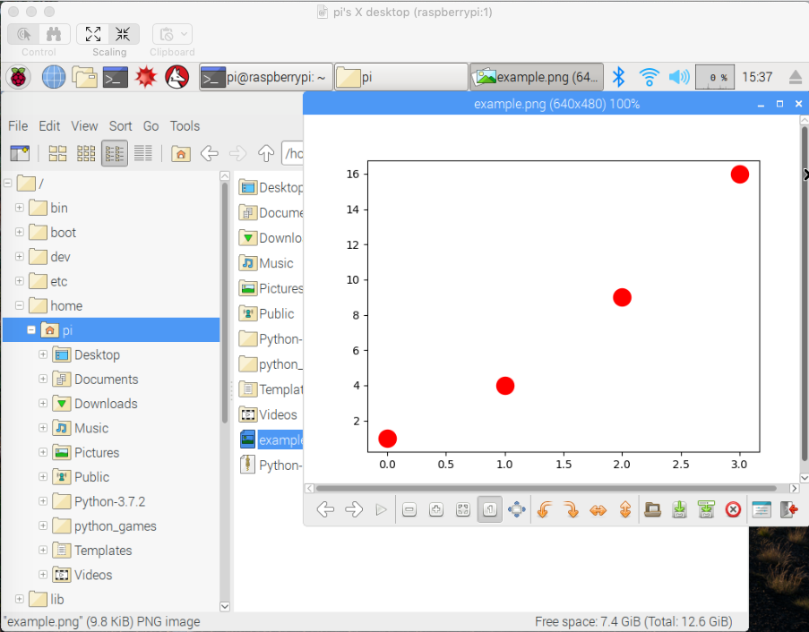

#### upgrade to Python 3.7

I followed [these](https://gist.github.com/dschep/24aa61672a2092246eaca2824400d37f) instructions, but substituting 3.7.2.  The build went fine, though it took a while.  I haven't built Python for a long time.

``sudo make install`` failed with

```
ModuleNotFoundError: No module named '_ctypes'
Makefile:1130: recipe for target 'install' failed
make: *** [install] Error 1
```

I found [this](https://bugs.python.org/issue31652) explanation.  So try

```
sudo apt-get install libffi-dev
sudo make install
```

and now it works:

```
pi@raspberrypi:~ $ python3.7
Python 3.7.2 (default, Feb 15 2019, 23:02:18) 
[GCC 6.3.0 20170516] on linux
Type "help", "copyright", "credits" or "license" for more information.
>>>
```

<hr>

Recall that our $PATH is 

```
/usr/local/sbin:/usr/local/bin:/usr/sbin:/usr/bin..

```

The first directory is empty.  The second one (``/usr/local/bin``) has our shiny new Python and it's sym-linked to ``python3``:

```
lrwxrwxrwx  1 root staff        9 Feb 16 01:15 python3 -> python3.7
-rwxr-xr-x  2 root staff 10963672 Feb 16 01:14 python3.7
lrwxrwxrwx  1 root staff       17 Feb 16 01:15 python3.7-config -> python3.7m-config
-rwxr-xr-x  2 root staff 10963672 Feb 16 01:14 python3.7m
-rwxr-xr-x  1 root staff     3103 Feb 16 01:15 python3.7m-config
```

This is the one we just built:

```
/usr/local/bin/python3.7
Python 3.7.2 (default, Feb 15 2019, 23:02:18)
```

Unlike with Homebrew on the Mac, we need ``sudo make install`` b/c of the permissions on ``/usr/local/bin`` and its parent ``/usr/local``:

```
pi@raspberrypi:~ $ ls -al /usr/local/bin
total 21456
drwxrwsr-x  2 root staff     4096 Feb 16 01:16 .
drwxrwsr-x 10 root staff     4096 Mar 13  2018 ..
```

The Python versions that come with the Pi are in ``/usr/bin``

```
pi@raspberrypi:~ $ ls -al /usr/bin/python*
lrwxrwxrwx 1 root root       9 Jan 24  2017 /usr/bin/python -> python2.7
lrwxrwxrwx 1 root root       9 Jan 24  2017 /usr/bin/python2 -> python2.7
-rwxr-xr-x 1 root root 3162224 Nov 24  2017 /usr/bin/python2.7
..
lrwxrwxrwx 1 root root       9 Jan 20  2017 /usr/bin/python3 -> python3.5
-rwxr-xr-x 2 root root 3976264 Jan 19  2017 /usr/bin/python3.5
```

There are also lots of ``pythonX-config`` files which I don't know anything about.

<hr>

With Python2, we have ``numpy`` but not ``matplotlib``:

``pip2 install matplotlib`` seems to work but ``import matplotlib.pyplot`` fails:

```
>>> import matplotlib.pyplot as plt
Unable to init server: Could not connect: Connection refused
Unable to init server: Could not connect: Connection refused

(.:2877): Gdk-CRITICAL **: gdk_cursor_new_for_display: assertion 'GDK_IS_DISPLAY (display)' failed
Traceback (most recent call last):
  File "<stdin>", line 1, in <module>
  File "/home/pi/.local/lib/python2.7/site-packages/matplotlib/pyplot.py", line 115, in <module>
    _backend_mod, new_figure_manager, draw_if_interactive, _show = pylab_setup()
  File "/home/pi/.local/lib/python2.7/site-packages/matplotlib/backends/__init__.py", line 62, in pylab_setup
    [backend_name], 0)
  File "/home/pi/.local/lib/python2.7/site-packages/matplotlib/backends/backend_gtk3agg.py", line 9, in <module>
    from . import backend_agg, backend_gtk3
  File "/home/pi/.local/lib/python2.7/site-packages/matplotlib/backends/backend_gtk3.py", line 32, in <module>
    cursors.MOVE          : Gdk.Cursor.new(Gdk.CursorType.FLEUR),
TypeError: constructor returned NULL
```

Maybe that's because there is no display?

Start the remote Desktop and

```
pi@raspberrypi:~ $ python2
Python 2.7.13 (default, Nov 24 2017, 17:33:09) 
[GCC 6.3.0 20170516] on linux2
Type "help", "copyright", "credits" or "license" for more information.
>>> import matplotlib
>>> import matplotlib.pyplot as plt

** (.:3110): WARNING **: Error retrieving accessibility bus address: org.freedesktop.DBus.Error.ServiceUnknown: The name org.a11y.Bus was not provided by any .service files
>>>
```

I get a different error.  Hmm...  Well, it's only a warning.

My favorite test:

```
>>> Y = [1,4,9,16]
>>> plt.scatter(range(len(Y)),Y,s=250,color="r")
<matplotlib.collections.PathCollection object at 0x7208bad0>
>>> plt.savefig('example.png')
>>>pi@raspberrypi:~ $
```

And there it is:



To get the actual file I tried:

```
> scp pi@10.0.1.7:example.png .
example.png           100%   10KB   1.3MB/s   00:00    
>
```


