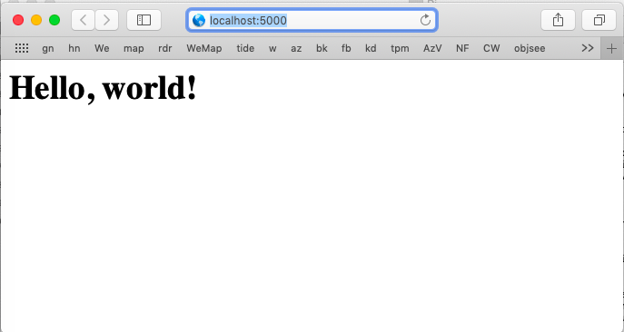

#### single-pyfile

This project is the world's simplest example of a project built with flask.  

It has a single python file at top-level

- app.py

and you run it like this:

```
> python3 app.py
 * Serving Flask app "app" (lazy loading)
 * Environment: production
   WARNING: Do not use the development server in a production environment.
   Use a production WSGI server instead.
 * Debug mode: on
 * Running on http://127.0.0.1:5000/ (Press CTRL+C to quit)
 * Restarting with stat
 * Debugger is active!
 * Debugger PIN: 848-640-805
127.0.0.1 - - [04/Mar/2019 16:10:17] "GET / HTTP/1.1" 200 -
127.0.0.1 - - [04/Mar/2019 16:10:17] "GET /favicon.ico HTTP/1.1" 404 -
...
```

We're using Python3, with flask installed (globally) by:

```
> pip3 install flask
```

When I point Safari at ``http://localhost:5000`` I get



<hr>

The code from ``app.py`` looks like this:

```
from flask import Flask
app = Flask(__name__)

@app.route('/')
@app.route('/index')
def do_index():
    return "<h1>Hello, world!</h1>"

if __name__ == "__main__":
    app.run(debug=True)
```

First an import and then ``__name__``, which has the value ``"__main__"`` when the script is run this way.

The ``@app.route`` thingies are "decorators" which tell Flask what function to call to generate the output when the index is requested by

- ``localhost:5000``
- ``localhost:5000/index``

All the magic of the web-server, etc. is hidden at this point.

One tricky thing is that when you shut down the web server with ``^Z`` and then re-run ``python3 app.py`` you get

```
OSError: [Errno 48] Address already in use
```

Use ``^C`` (``CTRL + C``).  ``^C`` gives the app time to shut down the socket, while ``^Z`` just kills it dead, dead, dead.