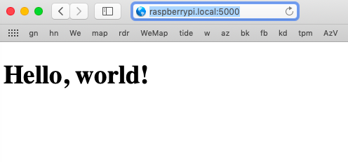

#### Specifying the port

The default port for the web-server set up by Flask is 5000, which is accessed by doing ``localhost:5000`` or the like.

This isn't visible from another computer on the local network.  To make the web-server accessible to the LAN, [this](https://techtutorialsx.com/2018/05/23/raspberry-pi-3-raspbian-exposing-a-flask-server-to-the-local-network/) says to specify the host as

```
host='0.0.0.0'
```

Only the ``0.0.0.0`` part is critical.  The port can be anything, say ``5000`` as we had before.

So modify ``app.py``

```
from app import app
app.run(debug=True,host='0.0.0.0', port= 5000)
```

#### On the Mac

``cd`` into the project directory and do ``python3 app.py``.

Point Safari at ``localhost:5000`` and it works as before.

Now, copy the project to the Py with

```
scp -r 4-ports pi@raspberrypi.local:~
```

At this point, I notice the ``.DS_Store`` file on the Pi.  This hidden file is used by the Mac's Finder.  It's just taking up space on the Pi, but it's not a lot of space, so I just ignore it.

I don't believe there's a switch for ``scp`` to ignore certain files.

#### On the Pi

```
$ python3 4-ports/app.py
 * Serving Flask app "app" (lazy loading)
..
```

and from a different login window:

```
$ curl localhost:5000
<!DOCTYPE html>
<html lang="en">
  <head>
    <meta charset="utf-8" />
  </head>
  <body>
    <h1><h1>Hello, world!</h1></h1>
  </body>
</html>
```

Safari on the Mac does not give the page.  At first, I get a 404 from Apache.  If I shut Apache down I get "cannot connect to server".

That's because I need to tell Safari

```
http://raspberrypi.local:5000
```

It works!



It works!

#### another route

It's easy enough to add another route to ``app.py``:

```
from datetime import datetime
..

@app.route('/time')
def getTime():
    time = datetime.now()
    return "RPI3 date and time: " + str(time)
```