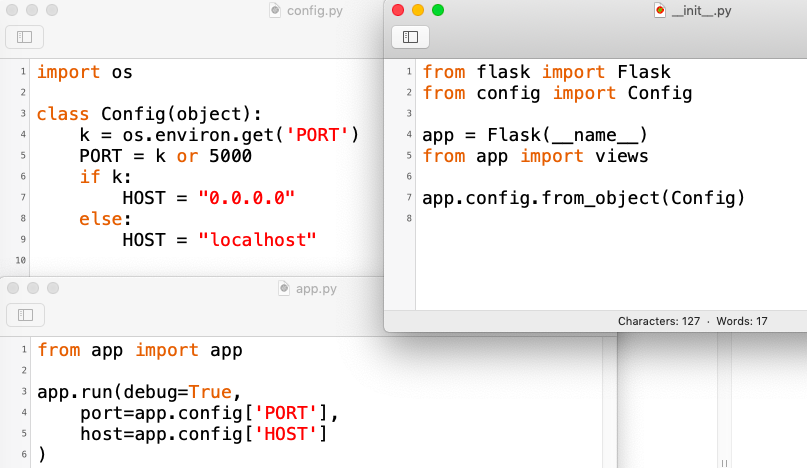

#### Configuration

We might want our web app to behave differently based on environmental variables.  

For example, for a deployment on Heroku we might want a different host and port than for local development.

One way to control that is to put code somewhere (say in ``app.py``) like this:

```
import os
from app import app

if 'PORT' in os.environ:
    # we're on Heroku
    host = "0.0.0.0"
    port = int(os.environ['PORT'])
else:
    host = "localhost"
    port = 5000
    
    
app.run(host=host, port=port, debug=True)
 
```

Then do:

```
> export PORT=8000
> python3 5-config/app.py
```

and 

```
> curl localhost:8000
<!DOCTYPE html>
...
```

#### Using ``config.py``

The more usual approach is to keep ``app.py`` uncluttered and use a separate file ``config.py`` at top-level.

Add this to ``__init__.py``:

```
from config import Config
app.config.from_object(Config)
```

So, even though ``config.py`` is at the same level as the ``app`` folder, inside the ``app`` folder in ``__init__.py`` we have access to ``config.py`` and can import the name ``Config`` from it, and then pass that object to the app so it will configure itself.

In ``config.py``:

```
import os

class Config(object):
    k = os.environ.get('PORT')
    PORT = k or 5000
    if k:
        HOST = "0.0.0.0"
    else:
        HOST = "localhost"
```

``__init__.py``

```
from config import Config
app.config.from_object(Config)
```

``app.py``:

```
app.run(debug=True, 
    port=app.config['PORT'],
    host=app.config['HOST']
)
```

So the Config object has Config.PORT, and when we do 

```
app.config.from_object(Config)
```

we're basically updating a dictionary, which is accessed in ``app.py`` by

```
port=app.config['PORT']
```

For more details, see [here](http://flask.pocoo.org/docs/1.0/config/#configuration-basics).

The slick part of this is that although ``app.config`` is basically a dict, it is smarter than that.  Above we did

```
PORT = k or 5000
```

where ``k`` is a string and 5000 is an int.  So you would think that ``PORT`` is one of those.  But it's actually a __ of the Config object.  After the update, ``app.config`` has a key ``"PORT"`` with the integer value ``int(k)`` or ``5000``.

Both of these calls do the same thing:

```
app.config['TESTING'] = True
app.testing = True
```

We can update by ``config.update``.

```
app.config.update(
    TESTING=True,
    SECRET_KEY=b'_5#y2L"F4Q8z\n\xec]/'
)
```

or in the code above ````config.from_object````.



#### Test

It works

```
> export PORT=8000
> python3 5-config/app.py
 * Serving Flask app "app" (lazy loading)
 * Environment: production
   WARNING: Do not use the development server in a production environment.
   Use a production WSGI server instead.
 * Debug mode: on
 * Running on http://0.0.0.0:8000/ (Press CTRL+C to quit)
..
```

We are on port 8000, etc.

<hr>

#### configuration

Above, we set up our web app to configure itself based on ``config.py``, which in turn depends on an environmental variable.

For our purposes, this is just as easily handled from ``app.py``, and clutters up the app, so for the future,s I will modify ``app.py`` to 

```
from app import app
app.run(debug=True,port=8000,host="0.0.0.0")
```

and change what's in ``config.py`` to give us a couple of secrets:

```
import os

class Config(object):
    k = os.environ.get('SECRET_KEY')
    SECRET_KEY = k or 'very-very-seecreet'
    SESSION_KEY = str(os.urandom(24))
```

Among other things, this setup allows us to pass in secrets from the environment, so they're not stored in the file that is in a repo online somewhere.
