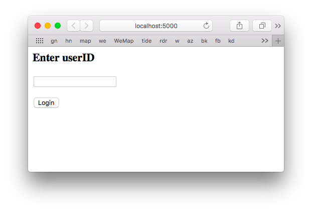
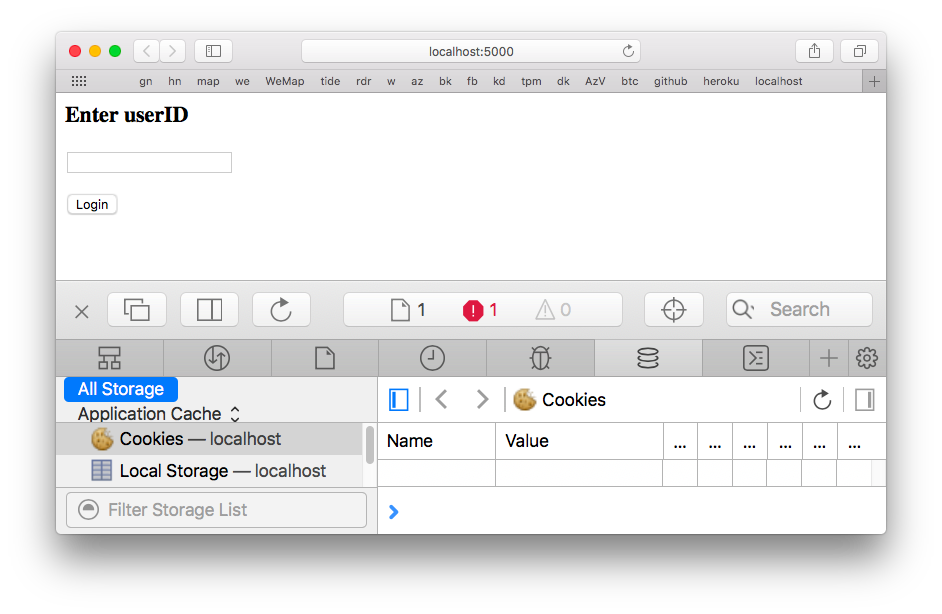
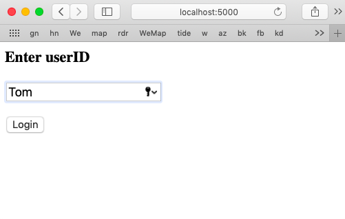
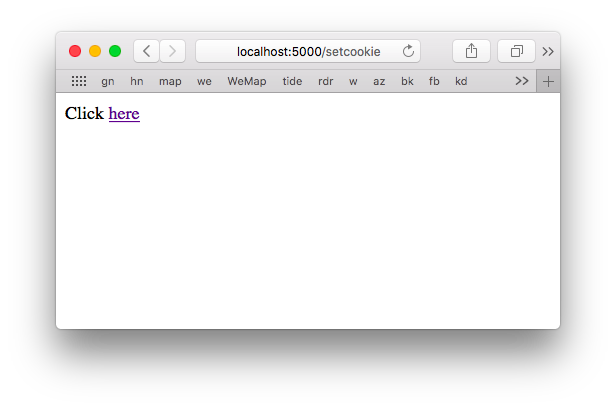
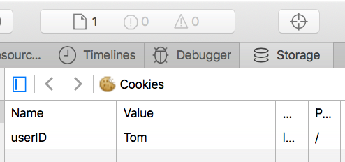
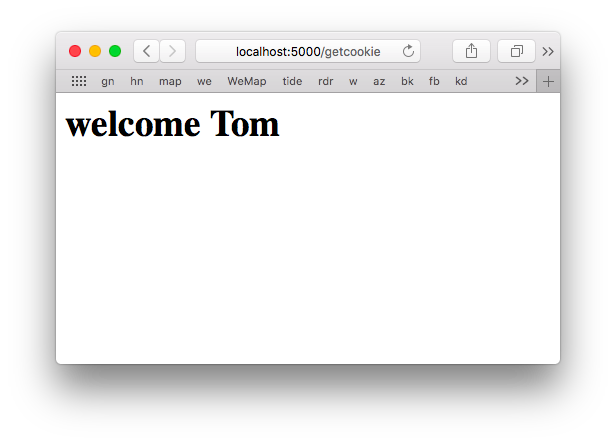

TL;DR

- the client browser goes to localhost:5000, enter
- server receives a GET request for ``/`` (index page)
- server sends ``form.html`` (to make clear what it is)
- client receives form containing text box and button
- client enters name in the form and clicks submit
- server receives ``POST /setcookie``
- server's ``setcookie()`` reads the form data
- server sends ``clickme.html`` with cookie **set**
- client receives a page saying click here, a one-liner
``<a href="http://localhost:5000/getcookie">here</a>``
- when clicked the cookie data goes back to the server
- server receives a ``"GET /getcookie`
- server returns pseudo-html, with name from cookie data

This stuff is tricky, because there are two points of view:  the client and the server.

#### Login form and tokens

Instead of continuing from the end of last time, we clone the version from [4-ports](../4-ports/README.md).  The port is ``5000`` for no good reason.

#### modify ``view.py``

First, add two new imports to ``view.py``:

```
from flask import make_response, request
```

The rest will be changed in a minute.  This part will stay, however, with the html page's name changed to be more informative to us:

```
@app.route('/')
@app.route('/index')
def do_index():
    return render_template("form.html")

```

and add more.

#### modify ``form.html``

So the ``/index`` route returns ``form.html``, which is a simple form:

```
<html>
   <body>
   
      <form action = "/setcookie" method = "POST">
         <p><h3>Enter userID</h3></p>
         <p><input type = 'text' name = 'nm'/></p>
         <p><input type = 'submit' value = 'Login'/></p>
      </form>
      
   </body>
</html>
```

Now go to ``localhost:5000`` in the Safari.  

When rendered, the form looks like this:



What happened is that a GET request comes into the server (you can see it in the Terminal output):

```
127.0.0.1 - - [05/Mar/2019 12:54:33] "GET /favicon.ico HTTP/1.1" 404 -
127.0.0.1 - - [05/Mar/2019 12:54:33] "GET / HTTP/1.1" 200 -
```

Actually, there are *two* GET requests.  The log indicates that we replied to Safari's request for a favicon with a 404 (page not found).

The second request is good, that's where we send ``form.html``.

It's not a surprise that the page source in Safari matches ``form.html`` exactly.  

To look for cookies click on Storage...  



No cookie yet.

#### Change view.py

The ``/index`` stays the same but we add a route for ``/setcookie``:

```
@app.route('/setcookie', methods = ['POST', 'GET'])
def setcookie():
    print('request.form', request.form)
    if request.method == 'POST':
        user = request.form['nm']
        r = make_response(render_template(
            'readcookie.html'))'t 
        r.set_cookie('userID', user)
        return r
   
@app.route('/getcookie')
def getcookie():
    name = request.cookies.get('userID')
    return '<h1>welcome '+name+'</h1>'
```

This tells Flask that we could reach this route ``/setcookie`` *either* from a POST or from a GET request.  

We're not going to use the GET part this time.  (Notice that we don't handle the ``or`` case above).

Back in Safari, I enter ``Tom`` in the form:



Click ``Login``.  This sends a POST request to the server.

#### Set the cookie

As we said, the form's action sent us to our view function ``/setcookie`` with a POST.  Recall the line from ``form.html``:

```
<form action = "/setcookie" method = "POST">
```

If it is reached via POST

``if request.method == 'POST':``

the code in the view function ``setcookie()`` obtains the user's name by calling ``request.form['nm']``.

```
@app.route('/setcookie', methods = ['POST', 'GET'])
def setcookie():
    if request.method == 'POST':
        user = request.form['nm']
        r = make_response(render_template(
            'clickme.html'))
        r.set_cookie('userID', user)
        return r
```

The response object has a method ``make_response``, which constructs a **response** object, and then uses it to set a cookie before the response is returned.  

(It's confusing that the view function is called ``setcookie`` and inside it we call ``set_cookie``).

The response object is told to ``set_cookie`` with the value: `` ('userID', user)``, before it is returned and the page sent to the client.

In the Terminal, the data (the name "Tom") we just entered come in with the ``POST``.  There's a print statement in ``getcookie()`` that displays it.

```
('request.form', ImmutableMultiDict([('nm', u'Tom')]))
127.0.0.1 - - [05/Mar/2019 12:54:38] "POST /setcookie HTTP/1.1" 200 -
``` 

What the server sends back is this:



Notice the displayed URL has ``/setcookie``.

#### readcookie

Here is ``clickme.html``.  That's the page that rendered above.  The page is a one-liner, just an html link:

```
Click <a href="http://localhost:5000/getcookie">here</a>
```

To us in the browser it looks like this:


If this is clicked a GET request will be transmitted to the route ``/getcookie`` and it carries along with it (all) cookies previously set.

To see the cookie, go to the Developer menu, show page source, and then click on Storage



So now, click on "here".

```
Click <a href="http://localhost:5000/getcookie">here</a>
```

It sends us to ``getcookie`` with a GET request.

We can see that in the Terminal.  

```
127.0.0.1 - - [05/Mar/2019 13:34:31] "GET /getcookie HTTP/1.1" 200 -
```

Our code to handle that is

```
@app.route('/getcookie')
def getcookie():
    name = request.cookies.get('userID')
    return '<h1>welcome '+name+'</h1>'
```

We just return some pseudo-html with the name filled in.

The cookie is used to output the username in the rendered page.  

```
name = request.cookies.get('userID')
```

``'+name+'`` looks funny but that's just string concatenation.



We run the app with ``python3 app.py``, and obtain the screenshots shown above.

Here is the whole sequence, from the server's view.  After the first ``localhost:5000``

```
127.0.0.1 - - [05/Mar/2019 14:00:18] "GET / HTTP/1.1" 200 -
127.0.0.1 - - [05/Mar/2019 14:00:19] "GET /favicon.ico HTTP/1.1" 404 -
```

After the submit button is pushed on the form with the name filled in:

```
request.form ImmutableMultiDict([('nm', 'Tom')])
127.0.0.1 - - [05/Mar/2019 14:01:15] "POST /setcookie HTTP/1.1" 200 -
127.0.0.1 - - [05/Mar/2019 14:01:15] "GET /favicon.ico HTTP/1.1" 404 -
```

(the top line is from a ``print`` in ``setcookie()``).

After here is clicked, the server says:

```
127.0.0.1 - - [05/Mar/2019 14:02:30] "GET /getcookie HTTP/1.1" 200 -
127.0.0.1 - - [05/Mar/2019 14:02:31] "GET /favicon.ico HTTP/1.1" 404 -
```
