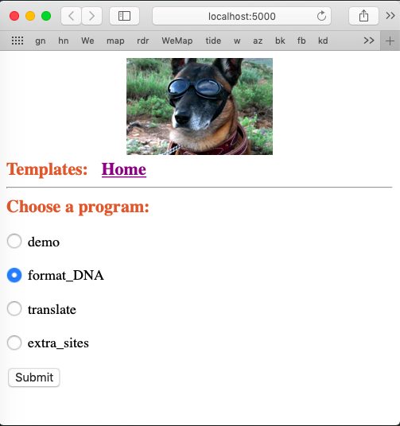

#### Templates

This is the front page we will build with templates:




Templates are part of the Jinja2 system [docs](http://jinja.pocoo.org/docs/2.10/).  It's pretty sophisticated.

The simplest idea of a template is variable substitution.

```
<h1>Hello, {{ name }}!</h1>
```

The variables to be substituted can come from lists, dictionaries or even objects.

There are filters, implemented as ``{{ var|filter }}``.  These include ``lower``, etc. but also ``safe``, ``capitalize`` and ``striptags``.  

With safe, ``<h1>`` becomes ``&lt;h1&gt;``.  Never use ``safe`` on user-entered data (because ... somehow bad things can happen).

#### Conditionals:  if

```

  Hello {{ user }}!

  Hello, Stranger!

```

#### Lists:  for

```
<ul>
  
    <li> {{ comment }} </li>
  
</ul>
```

Jinja2 has macros, which can be ``import``ed.  Template code can be ``include``ed from another file like ``source.html``.  

Template inheritance is particularly useful. 

We used this here. ``base.html``

```
<!DOCTYPE html>
<html lang="en">
  <head>
    <meta charset="utf-8" />
    <title>Template demo</title>
    <link rel="stylesheet" type="text/css" 
    href={{ url_for("static", filename="style.css") }}
  </head>
  <body>
    <h1>
      
    <h2>Templates: &nbsp;
        <a href="{{ url_for('index') }}">Home</a>
    </h2>
    <hr>

    
    

  </body>
</html>
```

We introduce our first *stylesheet*

```
<link rel="stylesheet" type="text/css" 
```

A static image obtained with ``url_for``

```
src="{{ url_for("static", filename='working_dog.png') }}"
```

The block content for this page comes from 

```




<form method="post" action="/dispatch">
<h2>Choose a program:</h2>



<p><input type="radio" name="prog" value="{{script}}" checked>  {{script}}</p>

<p><input type="radio" name="prog" value="{{script}}">  {{script}}</p>



<p><input type="submit" value="Submit"></p> 
</form>


```

Again, it looks like this:


And ``views.py`` is about what you'd expect, given the content we generated.

```
from flask import render_template, url_for

from app import app

script_list = ['demo',
               'format_DNA',
               'translate',
               'extra_sites']
               
default_choice = 'format_DNA'

def render_index_template():
    return render_template(
        "index.html",
        script_list = script_list,
        default=default_choice)          

# index shows form with scripts listed
@app.route('/', methods = ['GET'])
@app.route('/index', methods = ['GET'])
def index():
    return render_index_template()
```

The variables ``script_list`` and ``default`` are passed into the templating engine, and used in this code found in ``index.html``:

```


```
