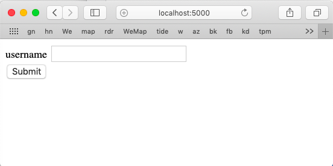
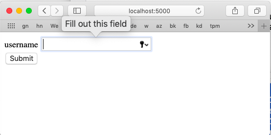
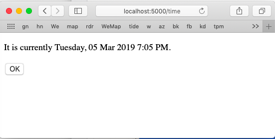

#### Forms

Before we start with forms, let's grab the WTF Flask [extension](https://flask-wtf.readthedocs.io/en/stable/) for [WT Forms](https://wtforms.readthedocs.io/en/stable/).

```
pip3 install Flask-WTF
```

``app.py`` is unchanged.  ``config.py`` has the bare assignments:

```
k = os.environ.get('SECRET_KEY')
SECRET_KEY = k or 'you-will-never-guess'
```

which we pick up in ``__init__.py`` with 

```
app.config.from_object('config')
```

This ``SECRET_KEY`` is important, as we will see next time.

Almost everything interesting happens in

#### ``views.py``

and in the forms themselves. The first part has all the imports we need

```
from app import app
from flask import render_template, request
from flask import redirect, url_for
from datetime import datetime

from flask_wtf import FlaskForm
from wtforms import StringField, SubmitField
from wtforms.validators import DataRequired
```

and then a class definition

```
class NameForm(FlaskForm):
    vL = [DataRequired()]
    name = StringField(
        'username',
        validators = vL)

```

The form looks like this:



The class defines a single field, namely a ``StringField`` with the label ``'username'``.  It has a single validator attached to it, ``DataRequired()``.

In this first example, the submit button is not from the FlaskForm but is just some html code on the page.

Here are the routes:

```
@app.route('/', methods= ['GET','POST'])
@app.route('/index', methods= ['GET','POST'])
def do_index():
    form = NameForm()
    if request.method == 'POST':
        if form.validate_on_submit():
            return redirect(url_for('time'))
        else:
            print('not validated', form.data)
    
    # either GET
    # or POST with failed validation
    return render_template(
        'hello.html', 
        form = form)

```

The basic idea here is that when we first go to ``localhost:5000`` this generates a GET request that comes to the index route.

We ``render_template`` with the template ``hello.html``.    Here is the file:

```
<!DOCTYPE html>
<html lang="en">
  <head>
    <meta charset="utf-8" />
    <title>Demo</title>
    <link rel="stylesheet" type="text/css" 
    href={{ url_for("static", filename="style.css") }}
  </head>

  <body>
      <form action="" method="post">
        {{ form.csrf_token }}

          <div class="input text">
              {{ form.name.label }} {{ form.name }}
          </div>

          <div class="input submit">
              <input type="submit" value="Submit" />
          </div>
      </form>
  </body>
</hmtl>
```

The text box comes from this div

```
<div class="input text">
    {{ form.name.label }} {{ form.name }}
</div>
```

and as mentioned, the button is just

```
<div class="input submit">
    <input type="submit" value="Submit" />
</div>
```

I believe the ``Fill out this field`` is from the validator.




The button submits the form data to the index route.  It's not explicit but that would always be a POST.

You can see it in the Terminal log

```
127.0.0.1 - - [05/Mar/2019 19:11:41] "POST / HTTP/1.1" 302 -
``` 

An HTTP 302 is a redirect which just gives the current time.

```
@app.route('/time')
def time():
    s = "%A, %d %b %Y %l:%M %p"
    the_time = datetime.now().strftime(s)
    return render_template(
        'time.html', 
        time=the_time)    

```

It looks like this:



What we didn't cover is

```
<form action="" method="post">
  {{ form.csrf_token }}
```

We'll talk about that next time.
