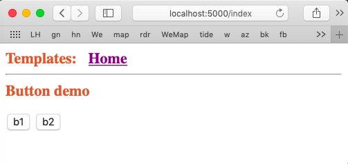

#### Basic buttons

This simple example uses the Jinja html template system, but doesn't use Flask forms. 

A form with a basic button looks like this (actually, a pair of buttons):



and it's coded in html:

```html
..
<form method="post" action="/dispatch">
<h2>Button demo</h2>

<p><input type="submit" name="button" value="b1" >  
<input type="submit" name="button" value="b2" ></p> 
..
```

This is an HTML form, with a POST method, and ``action="/dispatch"`` which will direct it to the dispatch route in ``views.py``.

The buttons are defined by ``input type="submit"``, they also have names and values.  

The value is displayed as the title of the button on the page the browser renders.

#### server side

Both the name and the value are transmitted to the server when a button is clicked.  They are available from the "request.form" object as key value pairs:

```
value = request.form["button"]
```

So, the first button with ``value="b1"`` is pressed, that's what we get in the ``do_form()`` function.  

It makes little sense (at least to me) to use different names for the two buttons, because then we would have to first search among the keys.

We do

```python
    print(request.data)
    print(len(list(request.form.keys())))
    value = request.form["button"]
    print("button", value)
```

and get in Terminal

```
b''
1
button b1
```

``request.form`` has only a single key here, ``"button"``, and ``request.data`` has nothing.  There are many more things in ``dir(request)``, so there's probably more to see there.
