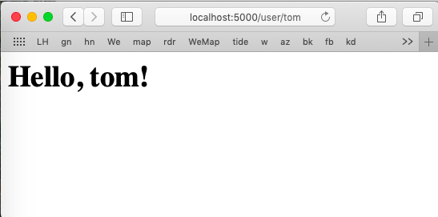

#### dynamic routes

A simple dynamic route looks like this:

```
@app.route('/user/<name>')
def user(name):
    return '<h1>Hello, %s!</h1>' % name
```

So if we use the single file web app and add the above route to ``app.py``, then start the app with 

```
python3 dynamic-url/app.py
```

and visit ``localhost:5000/user/tom`` in Safari, we get


