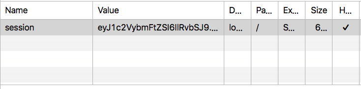
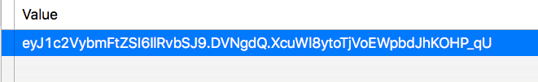
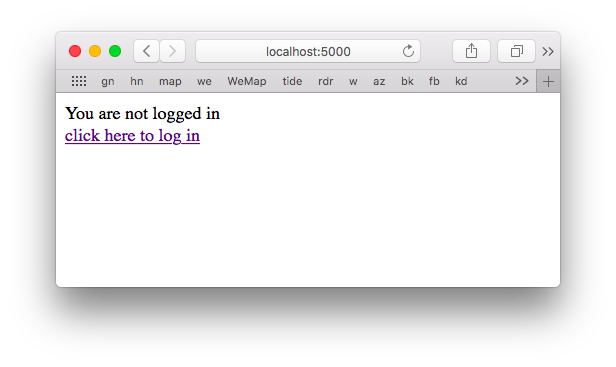
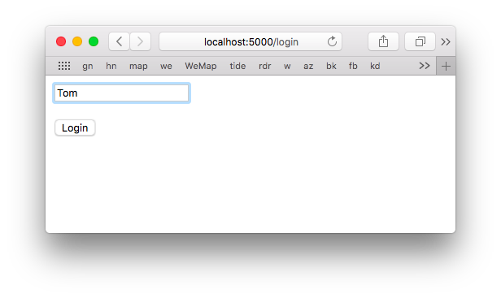
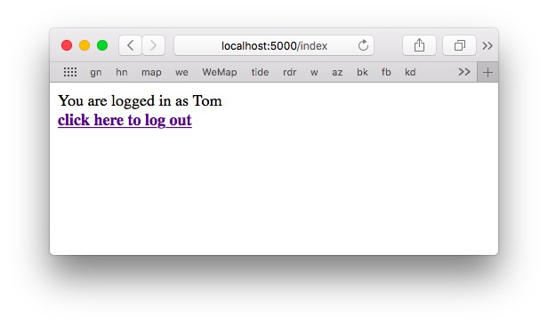

####  Session:  login and logout

The example is from [here](https://www.tutorialspoint.com/flask/flask_sessions.htm)

The code is all in a single file, not even any templates.

[app.py](app.py)

We do not use a virtual environment.  Instead, we have flask installed globally and we just do:

```
python3 app.py
```

In ``app.py`` there is a variable available from flask called session:

```
from flask import Flask, session, redirect
```

We must have the ``SECRET_KEY``

```
app.secret_key = 'any random string'
```

What will happen is that flask uses a cookie to keep track of users.



The cookie is signed, so it is cryptographically secure.

In one example, looking at Safari web inspector:

```
Name      session
Value     eyJ1..
Domain    localhost
Path      /
Expires   Session
Size      66B
HTTP      Yes
Secure    No
```

I expanded the column to see the whole value.



I count 59 characters. Probably the other bytes are flags for some of the values shown above.

I was unable to find the cookie itself using ``grep`` in ``~/Library/Safari``.

The session object is something like a dictionary, except to remove a key we use ``pop``:

```
session.pop('username', None)
```

#### What it looks like

The session object will be used to store a variable, ``username``. 

On the first visit to the index page, the username will not be found in session.  We return a link to the login page:

```
..
    r = '''
        You are not logged in 
        <br><a href='/login'></b>
        click here to log in</b></a>
        '''
    return r
```



The user clicks on "click here to login".  This comes into the ``login`` page as a ``GET`` request.  The response is a form:

```
   r = '''
        <form action="/login" method="post">
        <p> <input type='text' name=username> </p>
        <p> <input type='submit' value='Login'/> </p>
        </form>
        '''
    return r
```


The browser shows this after I have entered my name.



I click Login and we come back to "login" but this time as a ``POST``.

The code is

```
@app.route('/login', methods = ['GET', 'POST'])
def login():
    if request.method == 'POST':
        session['username'] = request.form['username']
        return redirect(url_for('index'))
```

We just place the data in ``session['username']``, and redirect to ``index``.  But now

```
    if 'username' in session:
        username = session['username']
        r = '''
            You are logged in as %s <br>
            <b><a href = '/logout'>
            click here to log out</a></b>
            '''
        return r % username       
```



We provide a link to ``logout``.  The code is

```
@app.route('/logout')
def logout():
    session.pop('username', None)
    return redirect(url_for('index'))
```

We do ``session.pop``.  And go once more to ``index``.