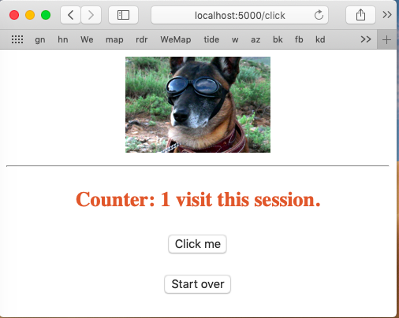
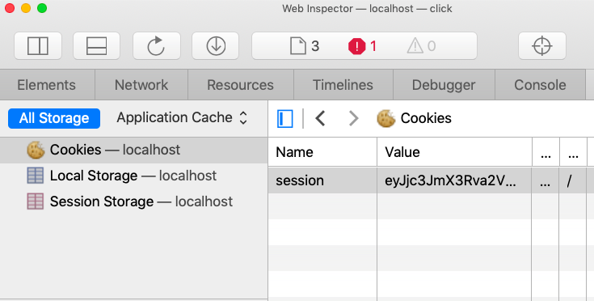

#### session

The session object acts like a Flask global variable that holds state, even though it is specific to the particular session.  (There's some magic in that).

> [in] a web session, the session is a data structure that an application uses to store temporary data that is useful only during the time a user is interacting with the application, it is also specific to the user.

We use it like so:

```
if 'visits' in session:
     session['visits'] = session.get('visits') + 1
else:
    session['visits'] = 0
```

What is happening is that the session "dictionary-like" object has a key that we set with ``session['visits'] = 0`` if it doesn't exist.  If it does exist, we increment it.  The ``'/reset'`` route resets it by 

```
session.pop('visits', None)

```

The logic for most of the routes is in ``do_form``, along with a lot of ``print`` statements:

```
def do_form():
    form = FlaskForm()
    
    print('in do_form')
    print('session data:')
    for k in session:
        print(k, session[k])
    print(len(session.keys()), 'items in session')
    print('**')
    
    print('form data:')
    for k in form.data:
        print(k, form.data[k][:35] + '..')
    print('*')

    template = 'click.html'
    count = get_count(session)
      
    plural = not (count == 1)
    if count == 0:
        count = "no"
    else:
        count = str(count)
        
    return render_template(
        template,
        form = form,
        count = count,
        plural = plural)
```

which simply gets the count from the session object, cleans up the grammar, and renders the result.  The form renders like this:



The ``form`` object

```
form = FlaskForm()
```

can't be made globally (I don't know why), so it must be instantiated on every request.  However, the bottom line is that this method works.

The form template itself takes data from the ``form``, ``count`` and ``plural`` variables.

The conditional part is

```
<h3>Counter:  {{ count }} 


  visits

  visit
 this session.</h3>
```

#### Two buttons and ``formaction``

There are two buttons in the click form.  

```
<p><input type="submit" name="click" value="Click me"></p> 
<p><input type="submit" name="zero" value="Start over" formaction="/reset"></p> 
```

The ``formaction`` statement overrides the form's action which would otherwise be from:

```
<form method="post" action="/click">
```

[Update:  the button's name and value come to us in Flask as

```
<value> = request.form[<name>]
```


#### client-side session storage

The second thing is that the information in the session is stored in the client as a session cookie.



The result of all those print statements is:

```
rdata: 
b''
*
in do_form
session data:
csrf_token cac007059e710f5819750a7f294bf48d3bb65ca0
visits 2
2 items in session
**
form data:
csrf_token ImNhYzAwNzA1OWU3MTBmNTgxOTc1MGE3ZjI..
*
```

#### finding the cookie

