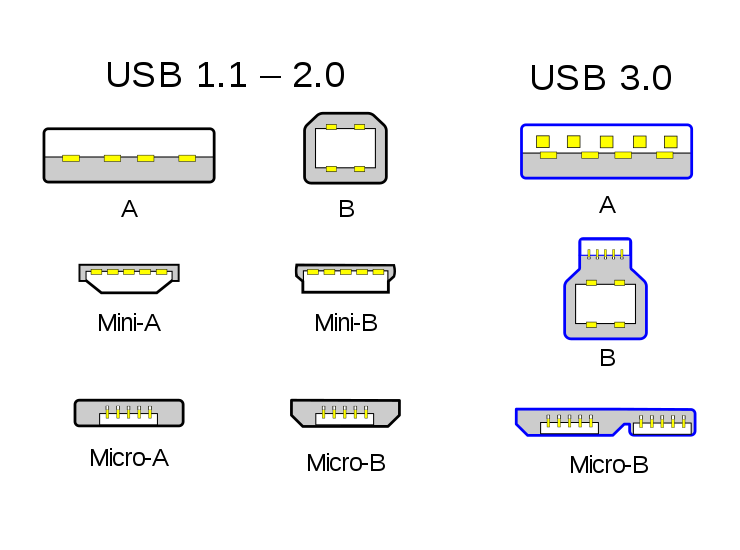

#### USB

#### oops

The new SD card I bought is an SDHC, standard size (see [here](SD.md)).  I had thought the card was a micro card --- that's the slot that the Pi has.

I bought a card reader so I can hook a micro card up to the Mac, which has standard USB ports.

The card reader says it takes both micro and standard SD cards so that part's OK.  I thought I could also use it to hook a standard size SD card up to one of the Pi's USB ports.

Unfortunately, the reader is not like the one I saw on Amazon, it has a micro USB port like for a phone, and when I look into the manual that came with it I see that it's a "Micro USB 2.0 for Windows and some Android devices."  

And ultimately what that means is there's no reason to make an female adapter that takes this guy and makes it into USB 3.0 male.  It's not much good for me.

#### USB connectors

These are not all the same.

There are numbers like 

- 1.x (1996)
- 2.0 (2000)
- 3.x (2008).  

There are powered and unpowered USB docks with multiple females and one male connector.  Power is important, some devices need a lot of power, which the Pi can't supply. 

And there are different physical connectors, which I hadn't appreciated before today beyond the fact that the standard type I've used forever is type-A, while 
B-type is for peripheral devices, like a camera.

A 3.0 male plug like on a newish USB thumb drive is backward-compatible, but it will only operate at USB 2.0 in a USB 2.0 device, of course.

There are Mini and Micro versions of both A and B.

Here is the illustration from wikipedia.

The card reader I bought is Micro USB 2.0.  It has rounded corners and matches the drawing in the bottom-middle.

