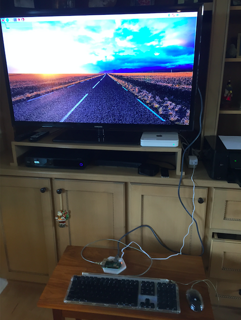

#### Configuration after initial power-up

What is supposed to be happening after plugging the Pi's power supply into the wall (or flipping the switch on your power strip) is that the NOOBS software runs from a FAT32 partition.

NOOBS then resizes the FAT32 partition to a minimum, makes a new partition suitable for Linux (ext4) of the maximum size allowed, copies the system software over there and then boots from it.

All this is transparent, and fast.  I didn't time it, but say, 30 seconds.

[ Much too fast according to later trials with NOOBS from the web --- my guess is the SD card is pre-formatted with the Linux files already installed. ]

NOOBS from the web requires WiFi before it will even start setting up the Linux partition and copying files.

