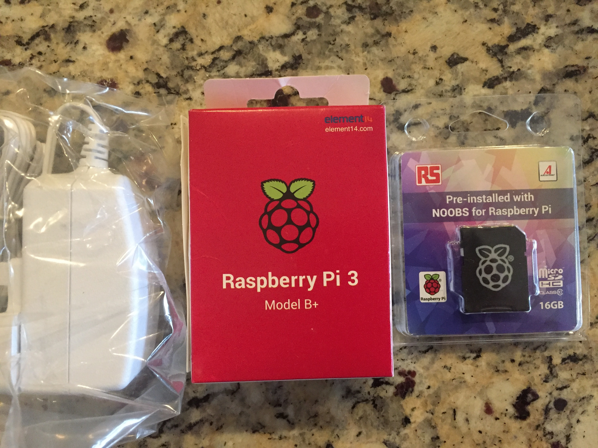

<b>2019 Feb 13-14</b>

I ordered

- [Raspberry Pi](https://www.amazon.com/gp/product/B07BDR5PDW/ref=ppx_yo_dt_b_asin_title_o02__o00_s00?ie=UTF8&psc=1)
- (micro) [SD card](https://www.amazon.com/gp/product/B01H5ZNOYG/ref=ppx_yo_dt_b_asin_title_o02__o00_s00?ie=UTF8&psc=1)
- [power supply](https://www.amazon.com/gp/product/B01LCNF8FU/ref=ppx_yo_dt_b_asin_title_o02__o00_s00?ie=UTF8&psc=1)

I didn't know at the time to check the speed of the SD card, luckily it is very good (class 10) and it is also the right physical size (micro).  

It's only 16 GB but I don't expect to use it that much.

I also ordered a USB hub and a

- 32 GB [USB 3.0 drive](https://www.amazon.com/gp/product/B015CH1JIW/ref=ppx_yo_dt_b_asin_title_o01__o00_s00?ie=UTF8&psc=1)

