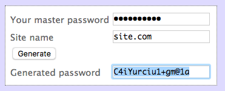

#### Passwords

Generating high-quality passwords is pretty easy.

[Here](http://angel.net/~nic/passwd.current.html) is a web page that lets you enter a master password and a website name and generates the SHA-1 digest for use as a website password.

Suppose your master password is "verysecret" and the website is "site.com".



To duplicate this utility, from Terminal you might concatenate the master password and the name of the website (which is what the javascript on the above webpage does) and do:

```
> printf "verysecretsite.com" | openssl dgst -hex -sha1 
cfee89f10829e2ccfa7e7b7be36564755454dfa0
>
```

The ``|`` symbol pipes the output of the ``printf`` command to the ``openssl`` utility.

If you want base64 output, just generate binary and feed that to the ``base64`` utility (or generate hex first, but the result will be different).

```
> printf "verysecretsite.com" | openssl dgst -binary -sha1 | base64
z+6J8Qgp4sz6fnt742VkdVRU36A=
>
```

If you want fewer characters use ``cut``

```
> printf "verysecretsite.com" | openssl dgst -binary -sha1 | base64 | cut -c -20
z+6J8Qgp4sz6fnt742Vk
>
```

The quoted text is sent to ``openssl`` to compute the digest, and the output is converted to base64 and then truncated.

Or in two steps:

```
> msg="verysecretsite.com"
> printf $msg | openssl dgst -hex -sha1
cfee89f10829e2ccfa7e7b7be36564755454dfa0
>
```

A problem with base64 is some of the characters (especially ``/=``) may not be legal in a password for some sites, and the point of this is to automatically regenerate the password when you need it in the future, so maybe hex is better, even though the entropy is less.

Bitcoin (and my app) use the [base58](en.wikipedia.org/wiki/Base58) character set, but that would involve installing a package to generate it.

<hr>

This is a lot to type for each new password.  There are a variety of solutions.

One is to use an alias for the part that's hard to remember.  First check that the alias has no pre-existing definition:

```
> dgst
-bash: dgst: command not found
> alias dgst="openssl dgst -hex -sha1 | cut -c -10"
>
```

We're using hex output now.  Then

```
> msg="verysecretsite.com"
> printf $msg | dgst
cfee89f108
>
```

Also, you'd probably like to have your master password stored.  If your master password is in an environmental variable:

```
> PW=verysecret
> printf $PW"site.com" | dgst
cfee89f108
>
```

We can take this one step further and do

```
> 
> PW=verysecret
> s=site.com
> printf $PW$s | dgst
cfee89f108
>
```

This stuff can be a bit tricky, however.  If we do

```
> printf $PWsite.com | dgst
27dad88631
>
```

This hash is different.  That's because the "." is unquoted above.

```
> printf ".com" | dgst
27dad88631
>
> printf $PW"site.com" | dgst
cfee89f108
>
```

<hr>

The alias and the environmental variable can be automatically loaded when you start Terminal.  One of the files that's read on launch is ``.bash_profile`` in your home directory.  This is what mine looks like:

```
> cat /Users/telliott_admin/.bash_profile
PS1="> "

alias te='open -a TextEdit'
alias oh='open -a Safari _build/html/index.html'
alias ts='python typeset/scripts/script.py'
alias prp='pipenv run python'


p0=$HOME/bin
p1=$HOME/Library/Python/2.7/bin
p2=$HOME/Library/Python/3.6/bin
#p3=/Library/TeX/texbin
#p4=/Applications/Postgres.app/Contents/Versions/latest/bin

export PATH=$p0:$p1:$p2:$PATH
> 
```

That definition for "PS1" is why my prompt is so short.  The default you probably have shows more info.

To open the file for editing you can do (from your home directory)

```
> open -a TextEdit .bash_profile
```

Or you can view hidden (.) files in the Finder with ``CMD + SHIFT + .`` and then drag and drop the ``.bash_profile`` file onto TextEdit.  To hide everything just do ``CMD + SHIFT + .`` again.

If I just add to ``.bash_profile``:

```
export PW=verysecret
alias dgst="openssl dgst -hex -sha1 | cut -c -10"
```

Then any time I launch Terminal I can do

```
> echo $PW
verysecret
>
```

The master password has been loaded into the enviroment.

```
> printf $PW"site.com" | dgst
cfee89f108
>
```

<hr>

You can get a bit fancier and write a shell script.  Suppose we leave the line

```
export PW=verysecret
```

but remove the 

```
alias dgst="openssl dgst -hex -sha1 | cut -c -10"
```

from ``.bash_profile``.

Add another line to put a directory on your ``$PATH``:

```
export PATH=$HOME/bin:$PATH
```

and make a new directory called ``bin`` in your home directory.

Now write the following two lines to a file and save it in ``~/bin/pw``

```
#!/bin/sh
printf $PW"$1" | openssl dgst -hex -sha1 | cut -c -10
```

Check it out from Terminal.  Change to the bin directory first.

```
> cd
> cd bin
> pwd
/Users/telliott_admin/bin
> cat pw
#!/bin/sh
printf $PW"$1" | openssl dgst -hex -sha1 | cut -c -10
>
> chmod 755 pw
> ls -al pw
-rwxr-xr-x@ 1 telliott_admin  staff  74 Apr 24 09:38 pw
>
```

The ``chmod`` command makes the pw file executable.  Now relaunch Terminal.  You can be on the Desktop or wherever.

```
> pw "site.com"
cfee89f108
>
```

In fact, here you don't even need the quotes.

```
> pw site.com
cfee89f108
>
```

You can even temporarily change the master password:

```
> PW=a_different_secret
> pw site.com
84cb1db277
>
```

Relaunching Terminal will restore the default.

#### Python

Here is a Python script to make random data (>= Python 3.6).  

We use the [secrets](https://docs.python.org/3/library/secrets.html) module.

```
# >= Python 3.6
from secrets import choice as ch

# no 0OIl+/
b58  = '123456789ABCDEFGHJKLMNPQRSTUVWXYZ'
b58 +=         'abcdefghijkmnopqrstuvwxyz'

n = 30
L = [ch(b58) for i in range(n)]
print(''.join(L))
```

Output

```
> python3 script.py 
ZGRq42wzvZfueK4Gj6uAufNU3mZJXb
> python3 script.py 
pEGyJakPK5XzD6tSjQLBwTA2gC25KB
> python3 script.py 
SttHvZtRrBSqDT44PoNCkMUdCEtRPY
>
```

In the interpreter:

```
> python3
Python 3.6.4 (default, Jan 18 2018, 18:09:57) 
[GCC 4.2.1 Compatible Apple LLVM 9.0.0 (clang-900.0.39.2)] on darwin
Type "help", "copyright", "credits" or "license" for more information.
>>> import secrets
>>> secrets.token_hex(10)
'cddf477fe9ce66991372'
>>> secrets.token_urlsafe(10)
'dELXwGTgC4xMTQ'
>>>
```