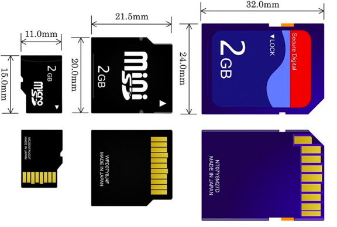

#### SD cards

[SD cards](https://en.wikipedia.org/wiki/Secure_Digital) (SD for secure digital) are non-volatile memory for portable storage devices.  

Both SD cards and USB drives contain the same type of memory (called NAND).

While SD card memory has a limited number of write cycles before failure, that limit is  [higher](https://superuser.com/questions/17350/whats-the-life-expectancy-of-an-sd-card) for modern cards (the first two answers at the link).

SD "cards" have evolved over time.  They include

- SDSC (standard capacity)
- SDHC (up to 32 GB)
- SDXC (up to 2 TB)
- SDUC (up to 128 TB)

exFAT has been adopted by the [SD Card Association](https://en.wikipedia.org/wiki/SD_Association) for SD cards larger than 32 GB.

#### Form factors

- standard SD 32 x 24 x 2.1 mm
- mini SD
- micro SD    15 x 11 x 1 mm



#### Speeds

- class 2 = 2 MB/sec
- class 4 = 4 MB/sec
- ..
- class 10 = 10 MB/sec

#### Raspberry Pi memory

The Raspberry Pi does not have onboard storage (besides RAM) but instead the operating system, user files, etc., reside on an SD card.

#### Writing to SD cards

I have just used the ``dd`` command [notes](../unix-cmds/dd.md).  

However, one must be very careful.  In the following:

```
dd bs=1m if=os.img of=/dev/rdisk2 conv=sync
```

If one were to make a mistake and specify, say, ``1`` as the number of the target disk for ``of`` (outfile), then I would likely lose my data and have to reinstall macOS.

I haven't had any trouble with this approach, mainly because my target turns out to always be ``/dev/disk2``.

The Pi [docs](https://www.raspberrypi.org/documentation/installation/installing-images/README.md) say the easiest way is to use [Etcher](https://www.balena.io/etcher/).

> Etcher is a graphical SD card writing tool that works on Mac OS, Linux and Windows, and is the easiest option for most users. Etcher also supports writing images directly from the zip file, without any unzipping required.
