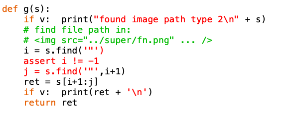

#### Testing for dead links

There's a lot of rearranging that goes into a project like this one.  When you do that, it is very hard to remember which files link to the one you are moving to a new location.

I wrote two Python scripts 

- [find.py](../python-scripts/find.py)
- and a helper [utils.py](../python-scripts/utils.py)

to check for broken links in a repo.  Here's some output:

```
> python find.py $ghd/Pi -v
..
----------
fn:   /servers/apache.md
link: ../figs/apache2.png
path: figs/apache2.png
OK:  file exists
----------
137 files searched: 137 OK
>
```

``$ghd/Pi`` is an alias for the project directory, and ``-v`` is a flag for verbose output.

Here are some of the highlights.

#### directory listing

We could use Python to go through directories and sub-directories, but this is easier.  Just launch a Unix process and run ``find`` on the directory that we're passed on the command line.

```
import subprocess
..
out = subprocess.check_output(['find', d])
```

#### Patterns

We are searching for links to files and images, which have distinctive patterns like:

- ``''``
- ``'``
- ``'[app.py](app.py)'``
- ``'[name](../path/to/file.md)'``

Regular expressions can be used to find these.  I find this subject challenging, so I'll keep it simple.

#### Python regular expressions

Suppose we want to recognize lines beginning with ``'a'``.  That is signified by ``'^a'``:

```
>>> import re
>>> p = re.compile(r'^a')
>>> t = 'abc'
>>> p.search(t)
<_sre.SRE_Match object at 0x106da3168>
>>> m = p.search(t)
>>> m.group(0)
'a'
>>> p.search('bac')
>>> 
```

Notice the lack of a match for the second target.

In the case of ``'[app.py](app.py)'``, we're looking for the pattern ``'[name](link)'``.

In searching for ``[``, we must escape the character, because it has a special meaning for regexes, namely, ``[abc]`` searches for *any* of ``abc`` or, for that matter, any of a range like ``[a-z]``.

Something like this:

```
>>> p = re.compile(r'\[.+\]')
>>> m = p.search('[name](link)')
>>> m.group(0)
'[name]'
>>>
```

The ``.+`` is a dot ``.``, which matches any character except a newline, and ``+`` means one or more of the preceeding character.

For some reason, the ``'('`` character is *special*, but it need not be escaped for this to work:

```
>>> p = re.compile(r'\[.+\](.+)')
>>> m = p.search('[name](link)')
>>> m.group(0)
'[name](link)'
>>>
```

This does not match 

```
>>> p = re.compile(r'\[.+\](.+)')
>>> m = p.search('')
>>> m
>>> 
```

However, I can fix that by doing:

```
>>> p = re.compile(r'\[.?\](.+)')
>>> m = p.search('')
>>> m
<_sre.SRE_Match object at 0x1065c0918>
>>> m.group(0)
'[](link)'
>>>
```

The ``?`` means to match *zero* or more of the preceeding character.

Now, theoretically, we could modify what's between the (inner) parentheses ``(.+)`` to exclude whitespace, which would solve one of the problems I ran into.  However, that doesn't work and I'm not sure why.

As I say, I'm not that swift with this.  I fall back on old standards like:

```
>>> s = ''
>>> i = s.find('"')
>>> j = s.find('"',i+1)
>>> s[i+1:j]
'../super/fn.png'
>>>
```

Python ``str.find`` takes an optional index telling at what position to start the search.  If no match is found, the result is ``-1``.  It's good to check for failure and respond accordingly.

Along the way, I found a syntax coloring bug in Smultron:



Smultron thinks ``'"'`` is a triple-quote, so it colors the characters until the second occurence as a string.  Python knows better.

#### Troubleshooting

I found three problems when examining the output for errors.  Sometimes we'd get paths with double slashes ``//``, this was just a logic error.

There were two kinds of weird patterns that matched the regex I used.  Some were in quoted blocks (bounded by three ` marks).  These were passed over with this logic:

    active = True
    for fn in L:
       ..
        with open(d+fn,'r') as fh:
             ..
             for line in sL:
            
                # don't read quoted blocks
                if line.strip() == '```':
                    active = not(active)
                if not active:
                    continue

The other one I just filtered out manually with

```
    if link == "via systemctl":
        return

```

#### Reporting results

At the end of the script I want to show statistics, something like:  "we searched ``n`` files and ``g`` of them were OK".

```
OK_files = dict()
run(OK_files)
D = OK_files
good = sum( [1 for k in D.keys() if D[k]] )
t = (len(D.keys()), good)
print('%d files searched: %d OK' % t) 
```

I used a global variable, a dictionary, which gets passed into ``run`` and then into ``check``.  For each new filename, we set a key in the dictionary to ``True``.

If, for any of possibly multiple links in a file, we have a problem:

```
if not os.path.exists(path):
    ..
    D[fn] = False
```

#### Running the script

In its current configuration in the file system, you can drag the filenames to Terminal.

So doing something like this is just a matter of two drag operations:

```
> python ~/Dropbox/Github/Pi/python-scripts/find.py \
~/Dropbox/Github/Pi 
137 files searched: 137 OK
>
```

However, normally I use an alias for the second path and run the script from the Desktop (with ``utils.py`` also present there):

```
python find.py $ghd/Pi
```