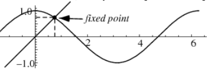

#### Example Python

I came across [a page](http://sprott.physics.wisc.edu/Pickover/trans.html), which says that there is a unique ``0 <= x <= 1`` for which ``x = cos x``.  The Wolfram [page](http://mathworld.wolfram.com/DottieNumber.html) is interesting.

It's called the "Dottie" number, eponymously, supposedly discovered by entering a value into a calculator and pressing the cosine button repeatedly, which will converge on the answer.

The solution is a transcendental number.  For more discussion of that see [here](https://math.stackexchange.com/questions/46934/what-is-the-solution-of-cosx-x).

The existence of a solution seems clear from a plot of the cosine function:



and the fact that it is a continuous function, and invertable within that interval.

I decided to write a short Python [script](../python-scripts/trig.py) to calculate this point.  The second half has the logic:

```
def close_enough(n,v,N=3):
    t = (1e-1)**N
    return abs(n-v) < t

n = 1
v = f(n)
count = 0

while not close_enough(n,v):
    count += 1
    n = v
    v = f(n)

print 'after %d rounds:' % count  
pp(n,v)

```

It uses a few tricks.  

In Python, the name ``e`` is not pre-defined (nor are ``1e`` and ``e-1``), but ``1e-1`` *is*.  It is equal to ``0.1``.  [similarly ``1e1`` and ``1e-9`` are also defined].

Two values ``n`` and ``v`` are close enough if the absolute value of their difference is less than that threshold value.

Initialize with

```
n = 1
v = f(n)
count = 0
```

where ``f`` will be one of sine, cosine or tangent.

Then, assign the result of ``f(n)`` to ``n`` until ``n`` and ``f(n)`` are close enough.

#### It prints:

```
> python trig.py cos
after 16 rounds:
0.73956720, 0.73876032
> python script.py sin
after 86 rounds:
0.18143336, 0.18043959
> python script.py tan
after 25 rounds:
0.04990694, 0.04994841
> 
```

(Note that also ``sin(0) = 0``).

#### More details

The first part assumes that a valid input is received on the command line, which comes in as a string in ``argv[1]``.

We also define ``pp``, a "pretty print" routine.

```
import sys

from math import *
D = {'sin':sin,
     'cos':cos, 
     'tan':tan}
     
f = D[sys.argv[1]]

def pp(n,v):
    s = "%3.8f, %3.8f"
    print s % (n,v)

```

The print routine uses old-style string formatting.

