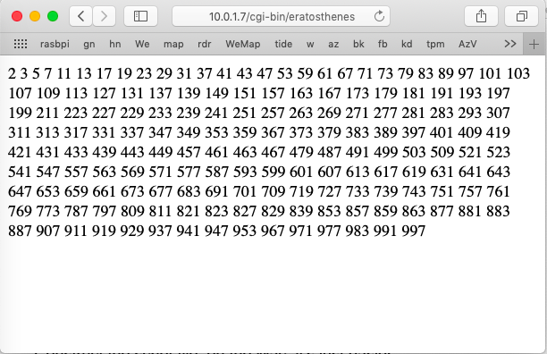
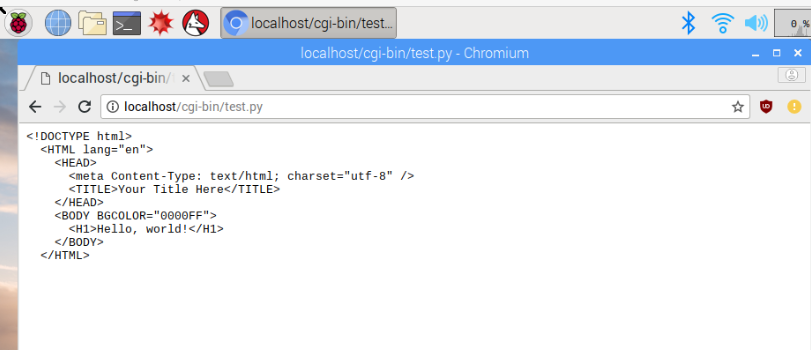
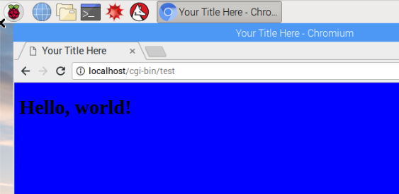

#### Apache with Python

TL;DR  To run Python scripts from the apache2 server, we must

- make the script "world-executable"
- place it in ``/usr/lib/cgi-bin`` (default)
- have ``libapache2-mod-python`` installed
- enable cgi
- start the server

Example:  [eratosthenes](scripts/eratosthenes)

From the Mac



Not pretty (yet), but it works!

#### Pi is for Python

Construct the script file, on the Mac, it's just easier ..

[**test.py**](scripts/test.py)

```
#! /usr/bin/python

print """
<!DOCTYPE html>
  <HTML lang="en">
    <HEAD>
      <meta Content-Type: text/html; charset="utf-8" />
      <TITLE>Your Title Here</TITLE>
    </HEAD>
    <BODY BGCOLOR="0000FF">
      <H1>Hello, world!</H1>
    </BODY>
  </HTML>
"""
```

From my previous explorations [here](https://github.com/telliott99/Ubuntu/blob/master/apache%20basic.md) and [super](https://github.com/telliott99/Ubuntu/blob/master/apache%20stop.md), to enable apache2 to run Python scripts we need 4 things:

- it must be world-executable
- it must be in ``cgi-bin`` under ``apache2``
- we must enable cgi
- we find we must ``install libapache2-mod-python``

#### Step 1

The first part's easy, either ``sudo chmod 755 test.py`` or ``sudo chmod a+x`` will do.


```
> sudo chmod a+x test.py
Password:
> ./scripts/test.py

<!DOCTYPE html>
  <HTML lang="en">
```

Now, copy it from the Mac to the Pi.

```
> scp test.py pi@10.0.1.7:~/test.py
test.py               100%  264    73.3KB/s   00:00    
```

It is in my home directory.

```
pi@raspberrypi:~ $ cat ~/test.py
#! /usr/bin/python
..
pi@raspberrypi:~ $ ls -al ~/test.py
-rwxr-xr-x 1 pi pi 264 Feb 17 17:24 /home/pi/test.py
pi@raspberrypi:~ $ ~/test.py

<!DOCTYPE html>
..
```

The permissions didn't change.

#### Step 2

For the next part we need to find ``apache2/cgi-bin`` on the Pi.

A quick look around was bewildering.  [This](https://askubuntu.com/questions/818348/location-of-packages-installed-by-apt-get-and-more) says ``dpkg -L`` find all the files installed with a package so:

```
pi@raspberrypi:/usr/sbin $ dpkg -L apache2 | grep "cgi"
/etc/apache2/conf-available/serve-cgi-bin.conf
/etc/apache2/mods-available/authnz_fcgi.load
/etc/apache2/mods-available/cgi.load
/etc/apache2/mods-available/cgid.conf
/etc/apache2/mods-available/cgid.load
/etc/apache2/mods-available/proxy_fcgi.load
/etc/apache2/mods-available/proxy_scgi.load
/usr/lib/cgi-bin
pi@raspberrypi:/usr/sbin $
```

So it looks like I want ``/usr/lib/cgi-bin``.  That's owned by root so

```
pi@raspberrypi:~ $ sudo cp ~/test.py /usr/lib/cgi-bin
```

#### Part 3

``a2enmode``

> a2enmod is a script that enables the specified module within the apache2 configuration. It does this by creating symlinks within /etc/apache2/mods-enabled. 
Likewise, a2dismod disables a module by removing those symlinks. It is not an error to enable a module which is already enabled, or to disable one which is already disabled.
> 

First, we need to turn the server back on...

```
pi@raspberrypi:~ $ sudo /etc/init.d/apache2 start
[ ok ] Starting apache2 (via systemctl): apache2.service.
pi@raspberrypi:~ $ ps -A | grep "apache2"
 1060 ?        00:00:00 apache2
 1061 ?        00:00:00 apache2
 1062 ?        00:00:00 apache2
pi@raspberrypi:~ $ curl localhost

<!DOCTYPE html
..
```

Now try:

```
$ sudo a2enmod cgi
AH00558: apache2: Could not reliably determine the server's fully qualified domain name, using 127.0.1.1. Set the 'ServerName' directive globally to suppress this message
Your MPM seems to be threaded. Selecting cgid instead of cgi.
Enabling module cgid.
To activate the new configuration, you need to run:
  systemctl restart apache2
$ sudo systemctl restart apache2
```
and then 

```
pi@raspberrypi:~ $ curl localhost/cgi-bin/test.py
<!DOCTYPE HTML PUBLIC "-//IETF//DTD HTML 2.0//EN">
<html><head>
<title>404 Not Found</title>
```

What's wrong?

[Update:  the second time through, it worked at this point.]

- the script is where I thought it was

```
pi@raspberrypi:~ $ /usr/lib/cgi-bin/test.py

<!DOCTYPE html>
```

- it seems that cgi is enabled

```
pi@raspberrypi:/usr/lib/cgi-bin $ ls /etc/apache2/mods-enabled/cgi*
/etc/apache2/mods-enabled/cgid.conf  /etc/apache2/mods-enabled/cgid.load
```

From the apache2 docs

> ScriptAlias
The ScriptAlias directive tells Apache that a particular directory is set aside for CGI programs. Apache will assume that every file in this directory is a CGI program, and will attempt to execute it, when that particular resource is requested by a client.

> The ScriptAlias directive looks like:

> ScriptAlias "/cgi-bin/" "/usr/local/apache2/cgi-bin/"
The example shown is from your default httpd.conf configuration file, if you installed Apache in the default location.

Where is the main configuration file?

```
pi@raspberrypi $ dpkg -L apache2 | grep "conf"
pi@raspberrypi $ cat /etc/apache2/apache2.conf
# This is the main Apache server configuration file.
...
```

But there's other stuff.  Google [says](https://www.linode.com/docs/web-servers/apache/apache-2-web-server-on-debian-5-lenny/) it doesn't come with Python support 

```
$ sudo apt-get install libapache2-mod-python
```

That does it!

```
pi@raspberrypi:~ $ curl localhost/cgi-bin/test.py
<!DOCTYPE html>
  <HTML lang="en"
    <HEAD>
      <meta Content-Type: text/html; charset="utf-8" />
      <TITLE>Your Title Here</TITLE>
    </HEAD>
    <BODY BGCOLOR="0000FF">
      <H1>Hello, world!</H1>
    </BODY>
  </HTML>

pi@raspberrypi:~ $
```

And from the remote desktop:



Hmm.. Not exactly what I'm looking for, but close.  It's because of the ``.py`` file extension.

```
pi@raspberrypi:~ $ sudo cp /usr/lib/cgi-bin/test.py /usr/lib/cgi-bin/test
```



And that's how you do it.