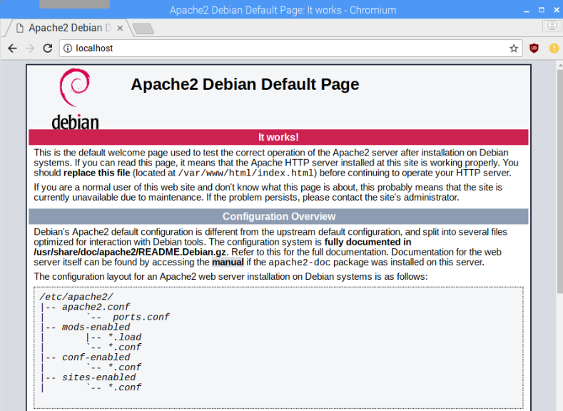
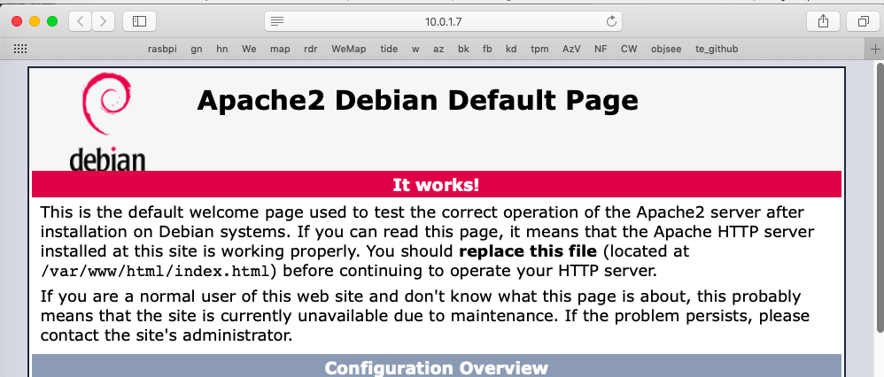

### Setting up an apache server

Note:  the Pi docs have a [page](https://www.raspberrypi.org/documentation/remote-access/web-server/apache.md) about apache.

#### Phase 1

```
$ sudo apt-get update
$ sudo apt-get install curl
$ sudo apt-get install apache2
```

The server starts running automatically:

```
$ ps -A | grep "apache"
 1668 ?        00:00:00 apache2
 1669 ?        00:00:00 apache2
 1670 ?        00:00:00 apache2
 $ sudo netstat -tulpn | grep :80
tcp6       0      0 :::80                   :::*                    LISTEN      1668/apache2
```

Yes!

And it'll serve the default page:

```
$ curl localhost

<!DOCTYPE html PUBLIC "-//W3C//DTD XHTML 1.0 Transitional//EN" "http://www.w3.org/TR/xhtml1/DTD/xhtml1-transitional.dtd">
<html xmlns="http://www.w3.org/1999/xhtml">
  <head>
    <meta http-equiv="Content-Type" content="text/html; charset=UTF-8" />
    <title>Apache2 Debian Default Page: It works</title>
..
```

If Stretch is the OS we can do this on the remote desktop:



Or from Safari on the Mac:  ``10.0.1.7`` in the address bar:



Shut it down for the moment.

```
$ sudo /etc/init.d/apache2 stop
[ ok ] Stopping apache2 (via systemctl): apache2.servic.
```

#### Apache2 auto-runs on boot

Let's see if it starts up automatically on reboot:

```
$ sudo shutdown -r now

[reboot and re-ssh]

$ curl localhost
..
```

Yep.  [link](https://www.linode.com/docs/quick-answers/linux-essentials/introduction-to-systemctl/)

Try using ``systemctl``:

```
$ sudo netstat -tulpn | grep :80
tcp6       0      0 :::80                   :::*                    LISTEN      535/apache2         
$ sudo /etc/init.d/apache2 stop
[ ok ] Stopping apache2 (via systemctl): apache2.servic.
$ sudo systemctl disable apache2
Synchronizing state of apache2.service with SysV service script with /lib/systemd/systemd-sysv-install.
Executing: /lib/systemd/systemd-sysv-install disable apache2
$ sudo netstat -tulpn | grep :80
$ sudo shutdown -r now
```

A second time through I get

```
perl: warning: Setting locale failed.
perl: warning: Please check that your locale settings:
	LANGUAGE = (unset),
	LC_ALL = (unset),
	LANG = "en_US.UTF-8"
    are supported and installed on your system.
...
```

I need to run ``sudo raspi-config`` (and do this from the console, not over ssh).


According to [this](https://raspberrypi.stackexchange.com/questions/64115/how-to-stop-apache-from-running-a-local-web-server-on-boot) try

```
$ sudo update-rc.d apache2 disable
```

and ``enable`` to revert.  Check with

```
$ sudo shutdown -r now

[reboot and re-ssh]

$ ps -A | grep "apache"
$ sudo netstat -tulpn | grep :80
$ curl localhost
curl: (7) Failed to connect to localhost port 80: Connection refused
```

Looks good to me.

```
$ sudo update-rc.d apache2 disable
```