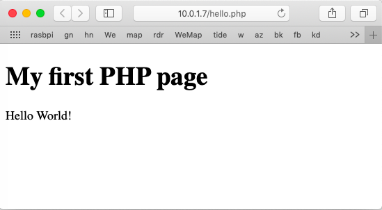

#### PHP

PHP stands for  Hpertext Preprocessor (i.e. to be used from HTML).

- PHP files can contain text, HTML, CSS, JavaScript, and PHP code
- usually returns HTML
- can also return images, PDF, XML
- scripts are .php files

Usually integrated with a web server.

#### Getting php on nginx

Boot a copy of ``lite-nginx-usb.img`` on a USB drive.

Following [this tutorial](https://www.raspberrypi.org/documentation/remote-access/web-server/nginx.md) with one small change.

See also [here](https://www.digitalocean.com/community/tutorials/how-to-install-linux-nginx-mysql-php-lemp-stack-ubuntu-18-04).

First get ``php-fpm`` (no need for ``php`` alone).

```
$ sudo apt-get update
$ sudo apt-get install php-fpm
```

Notice that what we got is ``php7.0-fpm``.

```
$ php -v
PHP 7.0.33-0+deb9u1 (cli) (built: Dec  7 2018 11:36:49)
```

#### nginx configuration

Edit

```
/etc/nginx/sites-available/default
```

in addition to the change to index

```
index index.php index.html index.htm;
```

We must change what the tutorial says to do this in the server directive ``test.com`` to:

```
location ~ \.php$ {
    include snippets/fastcgi-php.conf;
    fastcgi_pass unix:/var/run/php/php7.0-fpm.sock;
}
```

There is an extra directory ``php`` compared to the tutorial, and the version number is updated.

```
> scp test.com.php.txt pi@10.0.1.7:~/test.com
```

```
$ sudo cp ~/test.com /etc/nginx/sites-available/test.com
$ sudo service php7.0-fpm restart
$ sudo service nginx restart
```

#### script

hello.php

```
<!DOCTYPE html>
  <html>
    <body>

    <h1>My first PHP page</h1>

    <?php
    echo "Hello World!";
    ?>

  </body>
</html>
```

or

```
info.php

    <?php
    phpinfo();
    ?>
```

```
> scp hello.php.txt pi@10.0.1.7:~/hello.php
```

```
$ sudo cp ~/hello.php /var/www/test.com/html/hello.php
```

####

```
$ curl -s test.com/hello.php
<!DOCTYPE html>
  <html>
    <body>

    <h1>My first PHP page</h1>

    Hello World!
  </body>
</html>
```

should work.  It finally worked!!!  Even on Safari:




Running Python scripts on nginx is a bit complicated, so I have decided to hold off on this section for a while.

There is a school of thought that serving dynamic content (the result of the scripts) is better suited to Apache, and that what nginx excels at is speed and the ability to handle tens of thousands of simultaneous requests.
