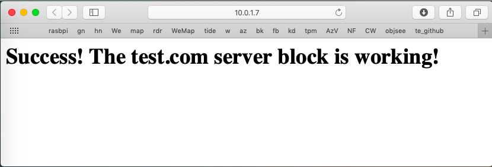

#### nginx server, first steps

TL;DR

We follow [this](https://www.digitalocean.com/community/tutorials/how-to-install-nginx-on-ubuntu-14-04-lts)

Note:  

- ``> `` prompt is the Mac (except for displayed html)
- ``$ `` is the Pi.

Prepare USB drive

```
> diskutil eraseDisk MS-DOS USB MBR /dev/disk2
> diskutil unmountDisk /dev/disk2
> cd ~/Downloads-saved/Lite
> sudo dd bs=1m if=lite-pub-usb.img of=/dev/rdisk2 conv=sync
> diskutil eject /dev/disk2
```

Install nginx

```
$ sudo apt-get update
$ sudo apt-get install nginx

$ sudo mkdir -p /var/www/test.com/html
$ sudo chmod -R 755 /var/www

> scp index.html pi@10.0.1.7:~
$ sudo cp ~/index.html /var/www/test.com/html/

> scp test.com.txt pi@10.0.1.7:~/test.com
$ sudo cp ~/test.com /etc/nginx/sites-available/test.com

$ sudo ln -s /etc/nginx/sites-available/test.com /etc/nginx/sites-enabled/
$ sudo rm /etc/nginx/sites-enabled/default

sudo nano /etc/nginx/nginx.conf
# uncomment:
server_names_hash_bucket_size 64;

sudo nano /etc/hosts
# add:
127.0.0.1       test.com

$ sudo service nginx restart
```

#### Setup

```
$ sudo apt-get upgrade
$ sudo apt-get install nginx
```

```
$ curl 127.0.0.1
<!DOCTYPE html>
  <html>
    <head>
      <title>Welcome to nginx!</title>
```

basic commands:

- ``sudo service nginx start/stop/restart``

auto start on boot (shouldn't be necessary now):

- ``sudo update-rc.d nginx defaults``

#### Make a new index.html page

From [here](https://www.digitalocean.com/community/tutorials/how-to-set-up-nginx-server-blocks-virtual-hosts-on-ubuntu-14-04-lts)

index.html:

```
<html>
  <head>
    <title>Welcome to test.com!</title>
  </head>
  <body>
    <h1>Success!  The test.com server block is working!</h1>
  </body>
</html>
```

```
> scp index.html pi@10.0.1.7:~
```

```
$ sudo mkdir -p /var/www/test.com/html
$ sudo chmod -R 755 /var/www
[sudo chown -R $USER:$USER /var/www/test.com/html]
$ sudo cp ~/index.html /var/www/test.com/html/
```

#### Make a server directive

test.com:

```
server {
    listen 80;
    listen [::]:80;

    root /var/www/test.com/html;
    index index.html index.htm;

    server_name test.com www.test.com;

    location / {
        try_files $uri $uri/ =404;
    }
}
```

```
> scp test.com pi@10.0.1.7:~
```

```
$ sudo cp ~/test.com /etc/nginx/sites-available/test.com
```

#### Symbolic link, and two small edits

```
$ sudo ln -s /etc/nginx/sites-available/test.com /etc/nginx/sites-enabled/
$ sudo rm /etc/nginx/sites-enabled/default
```

```
$ sudo nano /etc/nginx/nginx.conf
```
uncomment:

```
server_names_hash_bucket_size 64;
```

Then

``sudo nano /etc/hosts`` and add:


```
127.0.0.1       test.com
```


#### Test

```
$ sudo service nginx restart

pi@raspberrypi:~ $ curl test.com
<html>
  <head>
    <title>Welcome to test.com!</title>
..
```

#### From the Mac


```
> curl http://10.0.1.7:8080
<html>
  <head>
    <title>Welcome to test.com!</title>
..
```

It works!  From Safari on the Mac (with Listen 80 in the server directive file), type 10.0.1.7 in the address bar:



#### Change the port

One more thing.  

Try editing to substitute ``8080`` for ``80`` on the first line of test.com:

```
    listen 8080;
    listen [::]:80;
```

Copy it to ``/etc/nginx..``

```
> scp test.com.txt pi@10.0.1.7:~/test.com
```

```
$ sudo cp ~/test.com /etc/nginx/sites-available/test.com
$ sudo service nginx restart
```

```
pi@raspberrypi:~ $ curl test.com:8080
<html>
  <head>
    <title>Welcome to test.com!</title>
..
```

I test other ip addresses that I've seen in ``hosts`` examples:  

- 127.0.1.1
- 127.0.1.2

What all this means is beyond me at the moment, except that I know these addresses are all on the local network, and they work even if ``hosts`` has only 127.0.0.1.
