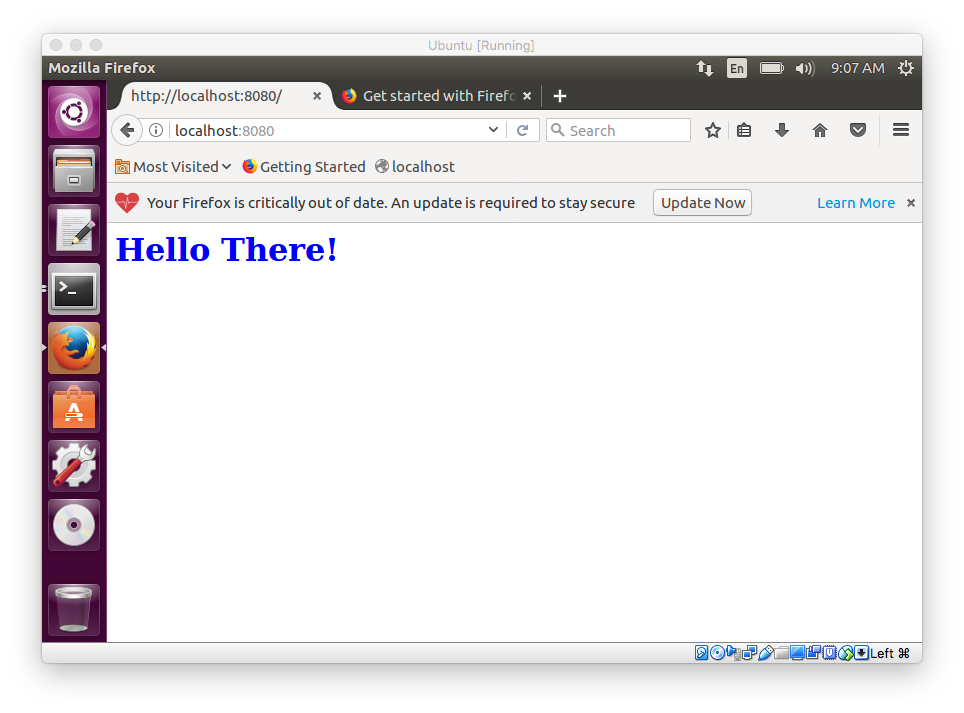

#### uwsgi

Following [this tutorial](https://www.digitalocean.com/community/tutorials/how-to-set-up-uwsgi-and-nginx-to-serve-python-apps-on-ubuntu-14-04).

```
$ sudo apt-get install python-dev python-pip
```

The tutorial uses ``virtualenv``.  I will skip that part here.

```
$ pip install uwsgi
..
Successfully installed uwsgi-2.0.18
```

```
$ mkdir myapp
```

and then type this in Text Editor

wsgi.py

```
def application(environ, start_response):
    start_response('200 OK', [('Content-Type', 'text/html')])
    return ["<h1 style='color:blue'>Hello There!</h1>"]
```

```
> scp wsgi.py pi@10.0.1.7:~/myapp
```

No execute permission is necessary. do:

```
$ uwsgi --socket 0.0.0.0:8080 --protocol=http -w wsgi
```

``uwsgi`` takes care of everything.  Start another Terminal window 

```
$ curl localhost:8080
<h1 style='color:blue'>Hello There!</h1>
```


