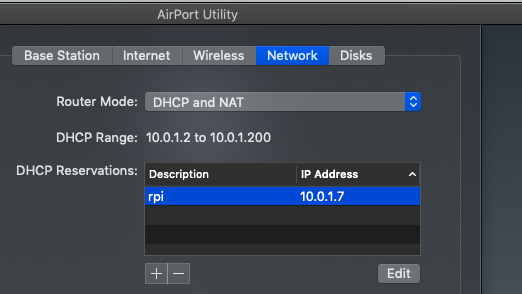
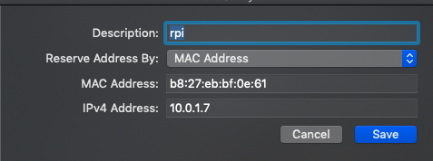

#### Trying to get my router to recognize Pi by hostname

```
> arp -a 
? (10.0.1.1) at 78:ca:39:xx:xx:xx on en0 ifscope [ethernet]
? (10.0.1.4) at 84:38:35:xx:xx:xx on en0 ifscope permanent [ethernet]
? (10.0.1.7) at b8:27:eb:xx:xx:xx on en0 ifscope [ethernet]
? (10.0.1.13) at c8:69:cd:xx:xx:xx on en0 ifscope [ethernet]
? (10.0.1.255) at ff:ff:ff:ff:ff:ff on en0 ifscope [ethernet]
? (224.0.0.251) at 1:0:5e:xx:xx:xx on en0 ifscope permanent [ethernet]
broadcasthost (255.255.255.255) at ff:ff:ff:ff:ff:ff on en0 ifscope [ethernet]
>
```

10.0.1.7 is the Pi, notice ``b8:27:eb``.
Mac address lookup gives "RASPBERRY PI FOUNDATION .."

#### research

[this](https://www.raspberrypi.org/forums/viewtopic.php?t=34620) says to install Bonjour

[more](https://www.raspberrypi.org/forums/viewtopic.php?t=18207)

```
sudo apt-get update
sudo apt-get install libnss-mdns
sudo shutdown -r now
```

The answer is said to be the Airport Utility doesn't get the hostname. 

#### get a rez





The answer seems to be the Airport Utility doesn't get the hostname.  I try reserving the ip address I've been getting anyway.

> ping rpi
ping: cannot resolve rpi: Unknown host
> ssh pi@rpi
ssh: Could not resolve hostname rpi: nodename nor servname provided, or not known
>

still doesn't work


```
> arp -a
? (10.0.1.1) at 78:ca:39:fd:59:ad on en0 ifscope [ethernet]
? (10.0.1.3) at 34:12:98:7:9c:55 on en0 ifscope [ethernet]
? (10.0.1.8) at c8:1e:e7:d5:fa:8d on en0 ifscope [ethernet]
? (10.0.1.255) at ff:ff:ff:ff:ff:ff on en0 ifscope [ethernet]
toms-airport-extreme.local (169.254.250.215) at 34:12:98:7:9c:55 on en0 [ethernet]
? (224.0.0.251) at 1:0:5e:0:0:fb on en0 ifscope permanent [ethernet]
broadcasthost (255.255.255.255) at ff:ff:ff:ff:ff:ff on en0 ifscope [ethernet]
```

Things have changed!  

- 10.0.1.3 is a new device
- My Mac was 10.0.1.4 is not shown
- The Pi is not shown
- The device at 10.0.1.13 is not there
- 10.0.1.8 is a new device

Login still works just as before.

```
ssh pi@10.0.1.7
```

Strange...


After deleting the reservation

```
> arp -a
? (10.0.1.1) at 78:ca:39:fd:59:ad on en0 ifscope [ethernet]
? (10.0.1.3) at 34:12:98:7:9c:55 on en0 ifscope [ethernet]
? (10.0.1.7) at b8:27:eb:bf:e:61 on en0 ifscope [ethernet]
? (10.0.1.8) at c8:1e:e7:d5:fa:8d on en0 ifscope [ethernet]
? (10.0.1.255) at ff:ff:ff:ff:ff:ff on en0 ifscope [ethernet]
? (224.0.0.251) at 1:0:5e:0:0:fb on en0 ifscope permanent [ethernet]
broadcasthost (255.255.255.255) at ff:ff:ff:ff:ff:ff on en0 ifscope [ethernet]
```

This is not what the Pi says:

```
pi@raspberrypi:~ $ arp -a
? (10.0.1.4) at 84:38:35:57:02:2e [ether] on wlan0
? (10.0.1.4) at 84:38:35:57:02:2e [ether] on wlan0
```